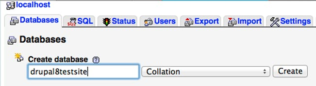
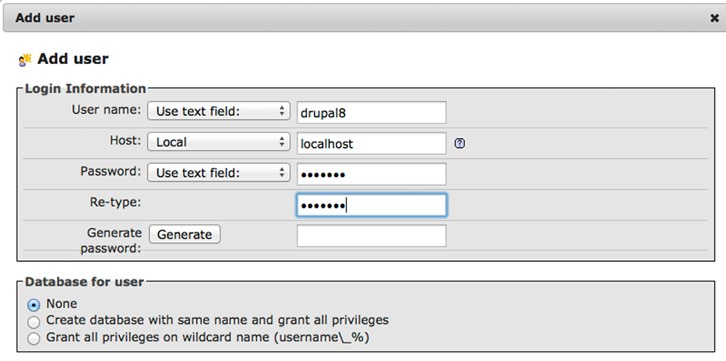
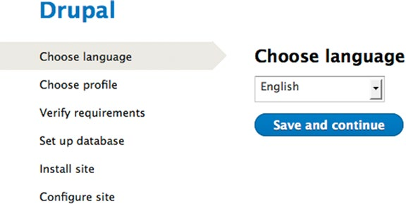
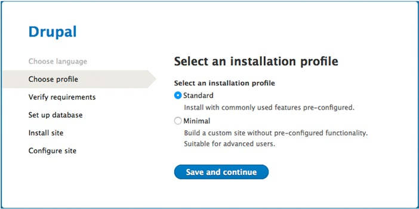
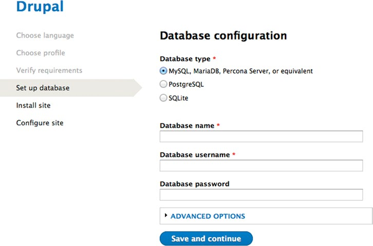
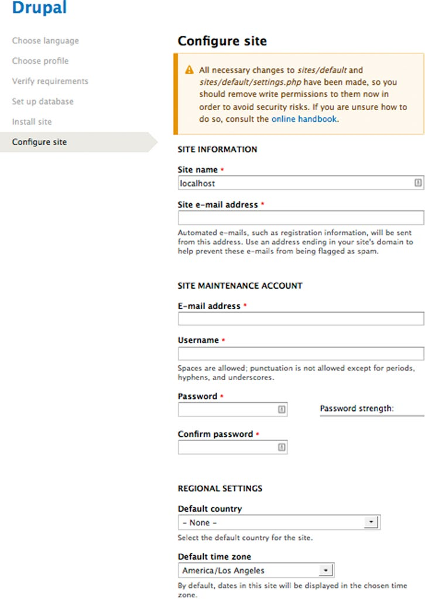

#附录A 安装Drupal  

**翻译：蓝眼泪**

如果你将你的站点安装在网络托管服务商提供的环境中，那可能有工具为你安装drupal，如果是这样你可以绕过附录，按照服务商提供给你的方向进行。但是如果你需要在你的笔记本、台式机或服务器上安装drupal的话，那么你可以看看这个附录。

在接下来的章节中，我会带你一步步的进行基础组件的安装-PHP、Mysql、Apache，以及drupal8的下载及安装。在附录最后，你将安装Drupal8，并通过书中的内容进行准备工作。

##安装Drupal所需基础

在安装Drupal前，你在即将安装Drupal的平台上需要有操作系统的权限。这个平台，不管是笔记本、台式机还是服务器，必须安装并配置几种软件用来支持运行Drupal需要的基本元素（MySQL、PHP、Apache和IIS）。操作系统和硬件的类型可依你的喜好进行选择，你可以在Windows、OS X，或基于Linux的平台上安装和配置Drupal，硬件可以是本地机（台式机、笔记本或有物理访问路径的服务器）或托管的服务器（由一个组织管理的分享或专用的服务器）。

在你开始安装Drupal之前，需要在平台上下载、配置及运行一下组件：  
* Web服务器：Apache，Nginx，Lighttpd，或微软的IIS服务器。在本书中，我用的是Apache，因为Apache在所有支持Drupal的平台上都能运行。有关安装和配置IIS的信息，请访问www.microsoft.com  
* PHP：Drupal使用的编程语言  
* 关联的数据库服务器：MySQL或PostgreSQL都可以。为了简化安装过程，我选择了MySQL。有关PostgreSQL的安装和配置信息，请访问www.postgresql.org  
* FTP（文件传输协议）：用于上传文件到服务器  
* 各种类库：用于图像处理、安全连接和邮件路由

如果你想在托管的环境中运行你的Drupal站点，你的托管服务商已经将建立基础组件的工作进行完了。如果你是使用的托管公司，那么你可以跳过“Drupal安装”这一部分。如果你要在台式机或笔记本上开发网站，然后将网站部署在服务器上，那么你需要在台式机或笔记本上安装并配置支持Drupal的基础组件，请照如下步骤进行。

##设置安装Drupal的平台

在安装Drupal之前，有三个基本组件要准备好：平台（硬件和操作系统）、Web服务器（软件，如Apache）、数据库（如MySQL）。如果你在一个商业托管公司的平台上，可以跳过“Drupal安装”这一部分，因为你需要的都是默认安装好的。

根据你平台上操作系统的不同，可能有些组件已经安装好了（如OS X已经安装了PHP和Apache）。然而，让所有组件一起工作对大多数人来说都是一个难点。有一群很有才华的人在www.apachefriends.org上创建了一个叫XAMPP的集成（all-in-one）软件包（XAMPP表示Apache，MySQL，PHP，Python），他的安装和配置对于最初级的技术人员来说都是很简单的。在Windows，OS X操作系统，Linux和Solaris上都可以安装XAMPP。

在XAMPP中包含的Drupal重要组件有：  
* Apache：处理请求的网络服务器软件包，有人发送请求时将服务器上的内容返回给申请人  
* MySQL：存储Drupal内容的关联数据库  
* PHP&PEAR：PHP，创建和维护Drupal的开发者使用的编程语言；PEAR（PHP扩展和应用程序库），PHP开发者使用的开源代码的一个结构化的库  
* PHPMyAdmin：一个很好的工具，可用于创建和管理数据库、表及存储在Drupal数据库中的数据

在 www.apachefriends.org上有在各个平台上安装XAMPP的详细说明。有一些东西可以替代XAMPP，如OS X的MAMP，要查找替代列表可在Goole中搜索“Apache AND MySQL AND PHP stacks”。

##安装Drupal

现在基本的组件已经安装完成，准备安装Drupal了。在服务器上安装Drupal有八个基本步骤，不管你是在Windows、OS　Ｘ操作系统、Linux还是共享主机的服务器上运行Drupal，这都是必须的。

1. 从http://drupal.org/project/drupal下载当前的drupal8安装包到你电脑上  
2. 解压缩Drupal的安装包tar.gz或zip文件  
3. 将解压缩的文件移动到你网络服务器的根目录下，如果你想在服务器上运行多个网站就移动到根目录的子目录下（如www-root/drupal8或htdocs/drupal8）
4. 创建settings.php文件
5. 创建files目录
6. 创建将用于新的Drupal站点的数据库
7. 创建数据库用户账户
8. 开始进行Drupal安装脚本以及设置网站  
这些步骤将在后续的章节中进行详细的描述。

###下载Drupal

下载Drupal很简单，访问www.drupal.org/project/drupal选择最新的版本和语言（如英语或法语）的Drupal，从主页上下载下来。Drupal版本号是随时间变化的，但是主页上的列出的最新版本是安全的，可以放心的下载、安装及配置。另外，通过Drush下载Drupal会更简单，详见第15章。

要下载Drupal，右击你想要下载的版本及格式即可，压缩文件（tar.gz或zip）会自动下载到你配置好的接收文件夹中。

###解压Drupal安装包

从Drupal.org上下载的是一个压缩包，压缩包中包含建立及运用Drupal8所需的所有文件和目录。你需要吧tar.gz文件或zip文件解压出来，可以通过双击文件（在OS X操作系统或Linux中）或用解压工具打开文件。双击文件将会在你电脑上创建一个文件夹，文件夹中是原始状态下的所有文件和目录。

——————  
注意：由于操作系统的不同或操作系统中文件管理器的不同设置，你可能会看到.htaccess文件，也keen那个看不到，因为它在Linux和OS X操作系统是隐藏文件。这是在下一步必须移动的一个关键的文件。如果你看不到.htaccess文件，请更新文件浏览器的设置使得你在进行下一步之前可以看到隐藏文件。其他的操作系统可能也有类似的文件，如IIS中的web.config.  
——————

###将Drupal移动到Web服务器的根目录下

下一步是将上一步中解压的Drupal文件夹中的所有内容移动到Web服务器下的根目录中。如果你使用的是XAMPP，根目录是XAMPP安装文件中的htdocs文件夹。如果你将Drupal安装在托管服务器中，根目录是托管公司指定的（例如，我使用的托管服务器的根目录是public_html），如果你不确定Drupal文件要放在哪里，可以让托管公司查一下。

当所有文件都放在了相应位置，可以进行下一步了。

###创建settings.php文件

Drupal用settings.php文件存储网站的配置参数，如数据库名称、访问数据库的用户名和密码。Drupal中有一个默认的settings.php文件将作文我们Drupal的起点。进入你上一步移动的文件夹中的目录sites/default，在这个目录下你会看到default.settings.php文件，复制这个文件并将新文件重命名为settings.php。

下一步，设置settings.php的权限使所有人都可以读取和更新文件。在更新进程中Drupal要有更新文件的能力。如果你不确定如果设置权限，查看一下你的操作系统设置权限的指南。

###创建files文件夹

Drupal将所有上传的文件和目录存储在服务器的一个目录上，该目录的标准名称是文件，在本机的话是sites/default目录。创建一个新的目录，命名为files，设置权限使网络服务器可以写入该目录。

###创建Drupal数据库

创建数据库是一个相对简单的过程。如果你在使用XAMPP或网络托管服务器，你可以使用phpMyAdmin管理工具，要使用你笔记本或台式机的管理工具，访问链接http://localhost/xampp(如果你使用XAMPP的话）或者是你已安装的有适当面板的链接，在工具条上你会看到phpMyAdmin，点击链接打开phpMyAdmin管理页面。

在这个页面上，定位在“创建数据库”标签的右下方的文本框中，输入一个简易且和网站相关的名字（用这种方法便于以后确定哪个数据库是与哪个网站相关的，尤其是当你的服务器上运行多个网站的时候）。MySQL是非常灵活的，你可以给你的数据库定义任何你想要的名称，但是，它还是有一些你要遵循的标准的，标准如下：  
* 只使用小写字符  
* 用下划线分割单词  
* 数据库名称不可超过64个字符（MySQL限制）

为了演示，我创建了一个数据库，名为“drupal8testsite”，输入数据库名称后单击创建按钮，如图A-1  
  
图A-1 创建一个新的MySQL数据库

下一步出现的屏幕上显示的就是我们创建的数据库。在这个页面可以创建表，但是我们并不需要做这一步，因为我们安装Drupal的时候数据表会自动创建。

###创建数据库用户账户

下一步是创建一个与我们刚才创建的数据库相关联的MySQL用户。你可以使用安装MySQL是自动创建的root账户，但为了安全起见，创建一个只访问该数据库的用户账户会更好一些。要打开创建用户账户的面板，单击“权限”选项卡即可，这个页面列出了所有的用户账户，单击页面底部的“添加用户”按钮。

在“添加用户”页面有四个字段要我们填写以创建新用户（见图A-2）  
* 用户名：这是我们数据库用户用来使Drupal登录数据库的唯一值。在这里我们输入“drupal8”。   
* 主机：这个字段限定了用户可以登录哪个系统。为了安全起见，我们从下拉列表中选择“localhost”，Localhost就是你的Web服务器，我们不希望用户从本地服务器以外的地方登录系统。  
* 密码：设置一个密码，并在确定密码（re-type）的字段输入相同密码。  
* 为用户分配数据库：保持默认，即none。

  
图A-2 创建一个新的数据库用户

当你点击按钮，phpMyAdmin就为你创建好了用户。最后一步是将你创建的用户分配给数据库，并将使用数据库所需的权限赋予新用户。要分配用户，单击刚刚创建的用户前方的图标，并向下滚动到“数据库特定权限”部分，从下拉列表中选择你创建的数据库，然后点击该部分的“转到”按钮，然后会出现一个列表，你可以通过这个列表授予用户数据库的操作权限，单击列表顶部附近的“检查所有链接”，然后单击“转到”按钮，现在可以开始配置Drupal了。

##Drupal设置

现在开始配置Drupal，打开浏览器，在地址栏输入“http://localhost”，如果你要将drupal8安装在根目录的子目录下，输入链接为子目录的路径，在第一页有站点可用的语言（见图A-3），我选择了英语，点击“保存并继续”。下一步允许你选择你希望安装的配置文件，标准（Standard）安装包含我在书中描述和使用的Drupal完整版的所有核心模块，最小配置（Minimal）是安装裸机版的Drupal，没有很多我在书中描述的核心模块。对绝大多数的Drupal网站所有者来说，标准版是一个比较正确的选择。如果你正在开发一个自定义平台（自己分配配置文件和特定模块），你可以选择最小模式（Minimal）。在当前例子中，我们选择标准版（Standard），点击“保存并继续”。  
  
图A-3 选择安装配置文件

在下一页，显示了你可以选择的配置文件版本，大多数情况下你会选择标准版（如图A-4）  
  
图A-4

下一页需要你提供之前创建的数据库的具体信息，在这个页面（如图A-5），完成以下字段的输入：  
* 数据库名称：输入你创建数据库时使用的名称（在例子中是“drupal8testsite”）。  
* 数据库用户名：输入你创建新用户时的用户名（在例子中是“drupal8”）。  
* 数据库密码：输入你创建新用户时的密码。  
  
图A-5 设置数据库参数

如果你忘记了之前设置的值，可以通过phpMyAdmin查看。

在你输入正确的值之后，Drupal将运行安装脚本。当Drupal创建了支持你新网站的数据表之后，你可以设置一些简单的参数（如图A-6）  
  
图A-6 网站设置页面

在这个页面要输入以下信息：  
* 站点信息  
  网站名称：你站点的名称  
  网站e-mail地址：这个默认e-mail地址将被用于发送Drupal系统生成的出站邮件  
* 网站维护账户  
  E-mail地址：这个地址是发出邮件的管理员相关的电子邮件  
  用户名：这是新网站的管理员用户名，最好是容易让你记住的名字  
  密码：输入管理员账号的密码  
  确认密码：在密码字段重新输入管理员密码  
* 区域设置  
  默认国家：你所在的国家（如果你不想指定默认国家可以保留None值，这是可选项）  
  默认时区：为你的网站选择合适的时区  
* 更新通知  
  自动检查更新：选中后，系统会自动检查Drupal核心及你安装的模块的更新情况，在突出情况下会显示发布的新版本及补丁。选中这个是个很好的选择，与手动检查更新比较的话它使得跟踪模块更新情况更容易。  
  接收电子邮件：如果选中的话，当Drupal检测到新版本的模块后会自动给管理员发邮件。

在你更新了这个选项的值之后，只需要单击“保存并继续”按钮即可。

点击这个按钮之后会出现一个页面，页面显示你已成功安装Drupal！

安装结束后，它会自动将你引导到网站的主页上。

##总结

在本附录中，我讲述了设置服务器及安装Drupal的内容。你现在可以开始使用Drupal8平台开启创建网站的旅程了。