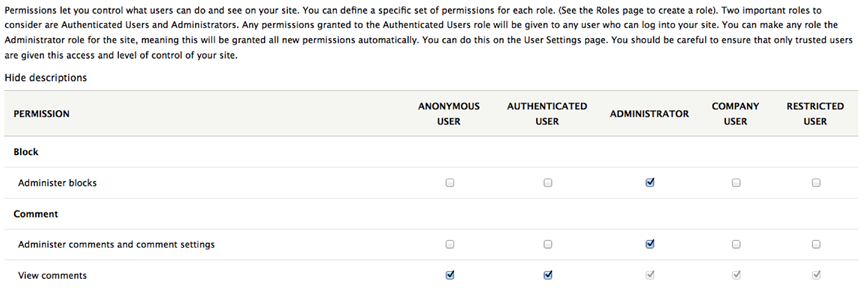
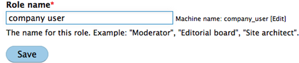
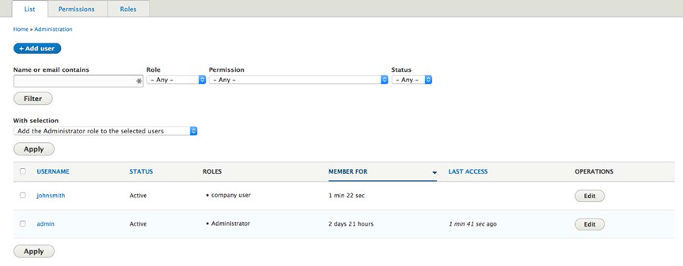
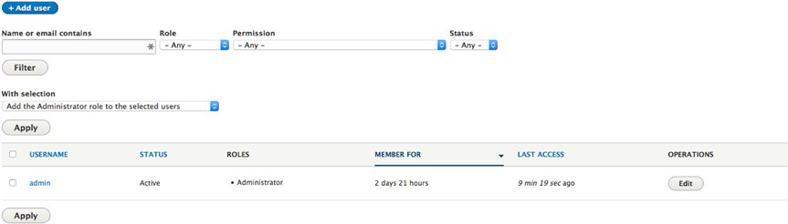
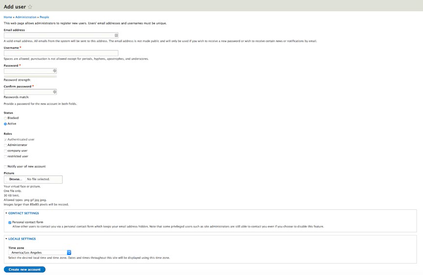
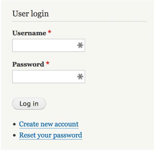
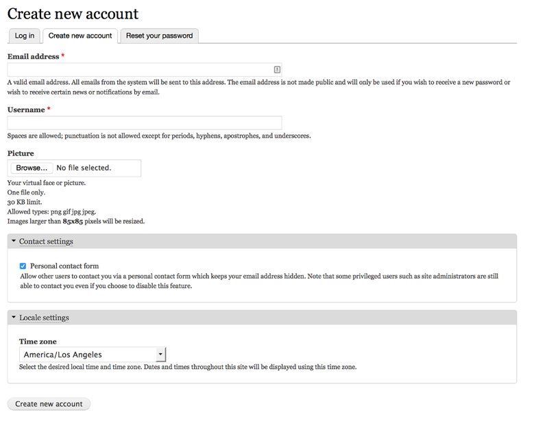

# 第三章 创建和管理用户 #

翻译：蹊

现在，您的网站已经建立和运行，你需要作出几个决定。首先，网站上除了你还有别的管理员吗？其次，你的网站是向所有人开放，或有用户需要登录查看内容和其他功能？在本章中，我将讨论Drupal如何对待您的网站的访客，以及如何作为网站管理员配置Drupal的功能，以限制你系统上的用户帐户的功能。

##用户，角色和权限##

控制谁在你的网站有权做什么，是通过Drupal的安全功能完成的。Drupal的安全功能通过个人用户账户、用户角色和权限的组合，来定义谁有权查看、创建、更新、删除。

Drupal 8 的用户（或站点访问者）分为两大类：匿名用户和身份验证的用户。匿名用户访问你的网站不用使用用户的个人ID和密码。如果您访问 www.cnn.com 时没有登录，你被归类为匿名用户。同Drupal，你能支持匿名用户，你也能在你的网站限制匿名用户。身份验证用户可以使用独一无二的用户ID和密码登录您的网站。我将介绍怎样快速创建用户ID和密码，但重要的是理解两类用户之间的区别。

角色是一个Drupal的机制，可以让你和站点管理员定义您的网站的验证用户的类别。你定义您的网站的角色时可以面向特定部门（例如，人力资源，采购，销售，市场营销和客户服务每个部门一个），也可以面向功能（例如，内容创作者，审稿的内容，内容发布商）的角色，也可以与您的网站的特定部分相关联（例如，产品支持，销售，主页），也可以是你能设想的其他任何定义。角色是一种简单的把验证用户进行分类的方式，并且分类与特定权限相关联。您的网站的任何身份验证的用户可能会被分配到无、一个、或者一个以上的角色（例如，你可能有用户分配到销售部门，内容作者和产品的角色）。

在 Drupal 中权限是用于控制某一特定角色下的用户可以做什么的机制。你可以在已定义的每个用户角色里启用或撤销几十个权限。你会为特定角色设置的权限可能包括：创建一个新的页面，创建一篇新的文章，编辑任何人撰写的文章，能在网站上搜索内容，添加新的用户帐户。权限组合就是你给每个角色定义了能力，即分配到角色的用户成功登录后可做的事。

当你把角色权限和个人账号结合，你就解决了靠关键特征和内容保证安全的高级配置方案。

##用户帐户

所有 Drupal 的网站至少有一个用户帐户:系统管理员。这个账户在安装过程中自动创建，并且是您用来管理你的网站的帐户。

只有网站管理员能创建内容和管理网站，拥有网站管理员的帐户是必须的。如果您预计会有其他人来管理或创建内容，那么你需要决定使用Drupal的哪个机制来创建用户帐户。Drupal提供了三种备选方案供您挑选：

- 只有管理员可以创建用户帐户。
- 游客可以无需管理员批准创建自己的帐户。
- 游客可以申请一个新的帐户，但管理员批准激活账户。

选哪一种方法，取决于你如何预见网站访问者。如果你的信息性质是游客不需要登录就能看到内容或参与网站功能（例如，发布评论），那么第一个选择是最好的方法，这区别于那些访问者必须登录才能看到的内容。如果你的网站有内容或功能被认为是“不为公共使用”，并要求有用户帐户，那么你要选择的方法取决于是否让访问者未经核实其凭据（第二个选项）创建他们的账号，或者您希望管理员执行某种形式的验证激活用户账户（第三个选项）。

配置您要使用的方案，这是配置你的系统的各种用户帐户设置过程的一部分。

##配置用户帐户设置

创建第一个用户帐户之前，建议您访问用户帐户设置页面，审查或修改一般用户帐户配置设置（见图3-1）。

要访问设置页面选择”管理”➤“配置”（假设你登录为管理员），在配置页上，定位段落标题“人员”。点击帐户设置链接，这将带你到你用来为用户账户设置各种配置参数的页面：

- 联系设置：您可以在站点上让个人用户有个人联系表。此功能默认启用，要禁用它，不选中框。
- 匿名用户：用于识别匿名用户的名称：在多数情况下，使用默认值“Anonymous”是合适的
- 管理员角色：管理员功能扮演什么角色:选择的角色作为你安装在系统的新模块的管理员，变成了默认角色。使用默认值“管理员”是一个合适的动作。（我将涵盖在本章后面的创建角色。）

**图3-1 帐户设置页面**
- 注册和注销：定义有关用户帐户的若干属性

注册：

谁可以注册帐户：如果只有管理员可以创建帐户，选择第一个选项“只有管理员”。如果任何访客到你的站点可以建立自己自己的账户，选择“访客”选项。如果游客可以申请账户，但是激活账户要管理员。此选项默认情况下选中。出于演示的目的，我会选择第一个选项，让只有管理员才可以创建用户帐户。

“要求电子邮件验证”，是一个不错的选择。此选项要求用户响应，要求他们回应 Drupal 生成的一个电子邮件。这有助于避免“机器人”创建用户帐户，因为大多数”机器人“没有智力和能力以响应用户帐户验证电子邮件。

密码强度指示器是一个有用的工具，它可以表明一个人的密码有多强。弱密码可以很容易被破解，而一个强大的密码很难被破解。这是一个很好的工具，帮助保持您的 Drupal 站点的安全。

当取消用户帐户时：一组选项允许您定义未来当你禁用用户账户时，这个用户账户在站点上发布过的内容会发生什么。在大多数情况下，默认选项，“禁用帐户，保留所有内容”满足大多数站点的需要。但是你可以决定其他选项以适合你的站点。

- 个性化：定义用户是否可以在个人资料添加签名，我会在测试站点设置默认值；但是，你可以启用或禁用签名，这取决于你是否愿意提供这些功能给用户。“通知的电子邮件地址”字段是drupal电子邮件注册和密码恢复进程中生成的用户账户中心邮件里的电子邮件地址。默认情况下，该站点的电子邮件地址在安装过程中就定义了的，你可以在“通知的电子邮件地址”字段输入一个有效的电子邮件地址覆盖默认的。

页面底部剩下的选项定义了系统生成的通知用户新账号的电子邮件格式，内容包含在每一封系统生成的电子邮件里。你可以依据个人偏好修改电子邮件内容。只需点击每个选项卡的垂直菜单，查看每个系统生成并发送给用户的邮件。如果您检查默认的内容，你会看到的值如：“[用户：姓名]”;这些 token 由drupal以动态内容插入到生成的邮件里。例如，[用户：姓名]将插入个人的用户名输入登记表并出现在电子邮件里有 token 的特殊点。

现在，您已经完成了用户账户的定义，您就可以定义角色并设置权限。

##创建角色

用户角色是一个根据你的网站上用户组的责任和能力来对用户分类的机制。如果您的站点是一所小学，则可能有教师、学生和员工的角色。如果你的站点是一个社区站点，则可能有内容作者、内容评审、发布者和论坛管理员的角色。

创建用户角色中最难的部分是决定你需要网站上有什么样的角色。一般来说，管理一个角色少的站点比管理一个角色多的站点容易，因为你必须给每个角色设置权限。然而，较少的角色意味着更少的灵活性，因此它是一个平衡的行为，往往是，你随着时间推移你必须调整站点上你已经熟悉的用户类型。不幸的，这里没有一个公式让你用来决定你需要多少角色，幸运的是，你需要多少角色也没有正确或错误的回答。在我们的例子中，我们将创建两个通用角色：

一种角色是我们组织的一部分，负责创建、发布和管理我们站点上的内容和菜单。

一种角色是提供进入“非公开”内容的访客，仅用于身份验证的用户（访客被分配一个用户ID和密码）。这些用户可以查看内容并添加注释内容，但不能创作，编辑或删除内容。

要创建新的用户角色，假设你用管理员帐户登录，点击页面顶部菜单的管理条，然后点击子菜单 People 链接。在“人员”页面，点击 Roles 标签，这个页面供你浏览，创建，编辑，和删除角色。在此页面上有一个空白文本框标题为 Role name ，这里你可以输入新角色的名称。为了演示的目的，输入 company user 作为新角色的名称（见图3-2）。

**图3-2 在人员页面操作角色**
点击保存按钮。公司用户角色创建的结果，显示在定义的用户角色列表里，如图3-3所示。

**图3-3 定义的角色列表**
对于你的第二个示例用户角色，进入“受限用户”，受限制的用户是任何用户用这个账号能查看站点上有限制的内容并对内容发表评论，但是不能创建、编辑、删除内容或在我们的网站上执行任何管理功能。点击“添加角色”按钮，文本框中输入值“restricted user”，然后点击保存按钮继续。

随着新角色的定义，你已经可以将权限分配给你创建的角色了。

##分配权限##

权限提供一种机制，用于控制分配到某一特定角色下的用户能做的事情和不能做的事情。

Drupal核心和每个贡献模块提供了一组预定义的权限，您必须在 role-by-role 基础上启用或禁止。将权限分配给角色，单击顶部的管理链接下的子菜单 people 链接（假设你以网站管理员的身份登录）。在人员页面单击权限标签，出现将要用于为每个已定义的角色设置权限的页面
（见图3-4）。

**图3-4 为每个角色设置权限**
这个页面列出了为你的站点和你的角色定义的所有可用权限。您可以向下滚动页面，您希望角色可以有这个权限就勾选，不希望就取消勾选。

出于演示的目的，往下滚动页面直到你找到段落标题节点，在那个段落为 company user 角色勾选下列方框：

- 文章：创建新内容
- 文章：删除自己的内容
- 文章：删除修改
- 文章：恢复修订
- 文章：查看修订
- 基本页面：创建新内容
- 基本页：删除自己的内容
- 基本页：删除修改
- 基本页：编辑自己的内容
- 基本页：恢复修订
- 基本页：查看修订
- 访问内容概述页面
- 管理内容
- 查看发布的内容

对于受限制的用户角色，向上滚动到注释部分，并确保以下权限勾选

- 查看评论
- 跳过审批意见
- 编辑自己的评论

一旦你已经勾选了选框所需的权限，滚动到页面的底部，点击“保存权限”按钮。此时，您已经创建角色并分配权限给那些角色。您现在可以创建用户帐户了。

##创建用户帐户

你现在已经定义了用户角色，也进行了适当的权限设置，已经可以创建用户帐户。创建一个新的用户帐户的过程首先是通过单击页面的顶部的菜单的管理，然后点击子菜单链接的 people 。点击显示如图3-5所示的页面的链接。

**图3-5 创建用户帐户**
此屏幕列出现有全部用户帐户。这里，列出的唯一账户是我们完成安装过程时创建的管理员账户，要添加新用户，请单击页面顶部“添加用户”按钮，会显示“添加用户”表单（如图3-6）

**图3-6 “添加用户”表单**
出于演示的目的，我们将通过输入以下值来创建一个新的用户帐户：

- 在E-mail地址字段中输入：johnsmith@example.com。
- 在用户名字段中输入：JohnSmith。
- 在密码字段中输入：12JohnSmith34。
- 在确认密码字段中输入：12JohnSmith34。
- Status，确认选 Active。
- Roles，选上 company user 选框
- 选上“将新建账号通知用户”选框（单击此选项使得Drupal能够发送一封邮件给用户，通知他们自己的新帐户）。
- 你可以选择上传用户照片(头像),通过勾选 Personal contact form 来启用这个人的个人联系表单 ，并依个人所在位置设置时区的值。出于演示目的，我们将保留这些字段默认值。
- 点击“创建新账号”按钮保存帐户。
- 点击管理员菜单下的 people 链接，可查看您的网站用户账号的完整列表（见图3-7），包括您刚刚创建的。
 

**图3-7 您的网站的所有用户帐户**
约翰•史密斯现在可以登录到你的网站，并执行与 company user 角色相关联的所有任务。

举例，您可能要更新用户账号。例如，您可能需要重置用户的密码，更改他或她的电子邮件地址，更新他或她指定的角色，或禁用该帐户。

你可以通过点击“人员”页面上用户账号相关联的链接来执行这些动作。

##用户生成的帐户

如果你配置你的站点为游客可以创建他们自己的账号，要求站点管理员审核批准他们的帐号，这个过程与管理员自己创建用户账户略有不同。

如果你选择用户帐户选项为游客可以创建账户但是需要管理员的批准，或者游客可以创建自己的帐户无需管理员批准他们的帐户，登录表单主页上会有一个额外的选项在“登录”按钮下面: “创建新账户” 。参见图3-8。

**图3-8 创建新账户选项**
点击这个链接（当你没有登录），带你进入一个屏幕，访问者可以输入他们的请求的用户名和电子邮件地址（见图3-9）。在这个例子中，输入用户名和电子邮件地址为新的帐户，并点击“创建新帐户”。（注：Drupal只允许你整站只用一个email地址，尝试重复使用email地址会弹出该账户已经存在于系统的错误提示。）

**图3-9 输入新账户信息**
一旦账户被创建，Drupal发送电子邮件到用户输入的电子邮件地址，显示一个成功信息：“感谢您申请一个帐户。你的帐户目前正在等待由站点管理员批准。同时，进一步指示的欢迎消息已经发送到你的电子邮件地址。”

如果你把系统配置为允许用户创建一个帐户，但要管理员手动批准该帐户，您需要访问联系人页面，然后编辑该用户的帐户，更改用户的从状态阻止到活动。直到用户的状态已经改变，他们将无法用用户名和密码登录到你的站点。如果你选择的选项是用户可以创建一个帐户，且帐户不需要管理员的批准，用户将能够立即登录到您的站点。

##重置用户密码

Drupal的特性之一，节省站点管理员一年的工时，能为用户重置密码，免去用户电邮管理员要求重置密码。如果你登出你的站点了（点击页面右上角的退出链接），你会注意到，右边栏“登录”按钮下面，有重设密码的链接（参见图3-8）。

点击这个链接打开一个页面，访问者可以输入自己的用户ID或他们的电子邮件地址。

输入一个有效的用户名和一个有效的电子邮件地址（其中“有效”是指它作为您的站点的有效用户ID存在，或是您站点上的用户帐户相关联的一个有效的E-mail地址）使得drupal生成含有“一次性登录”链接电子邮件发给用户，使他们能够重置密码。

##总结

在这一章中，我介绍配置Drupal如何处理用户帐户和如何创建用户角色并分配权限给这些角色的过程和方法。我讨论了，决定作为网站所有者就必须设置你的站点，包括是否只有你能管理这个站点并创建内容，是否会有其他人负责那些区域。

如果其他人分配到创建内容或管理站点的任务，那么你会想配置用户帐户的基础设置，创建会在你的网站执行活动的角色并设置相应的权限。您还需要定义是否只有管理员能创建帐户，或者游客可以创建自己的帐户无需管理员批准，或游客可以创建一个帐户，但管理员必须批准它。一旦你做出这些决定并设置这一章中讨论到的参数，你就可以开始将用户添加到您的站点。

你可以管理来访者，但是如果他们不能在你的站点上找到感兴趣的内容，他们不会留下，这就是分类，将是我们接下来要谈的。