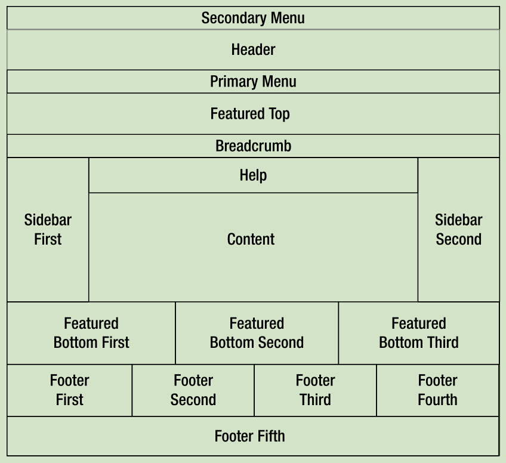
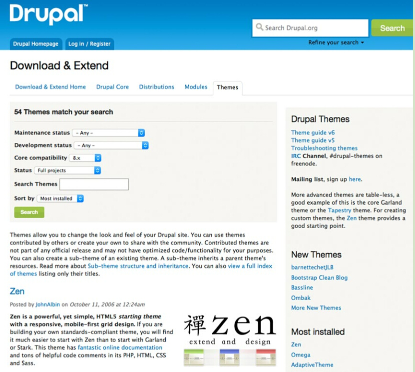
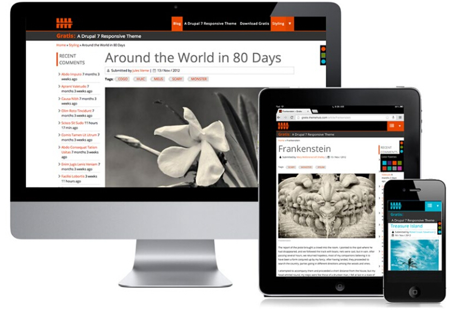
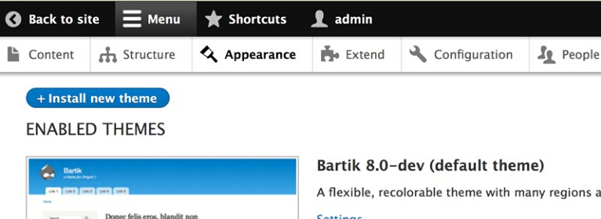
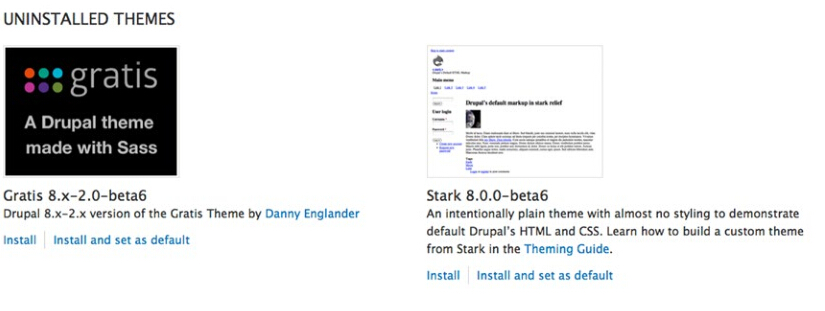
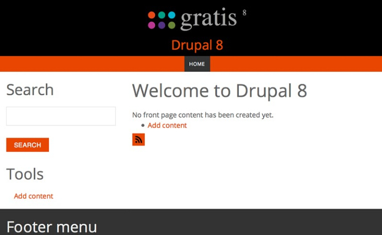
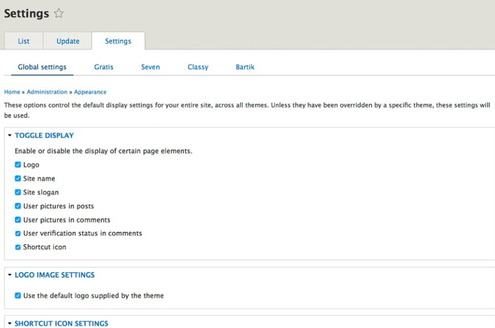

#第6章：使用Drupal主题

**翻译：phpworld**

在本章当中，我将介绍如何安装一个新的主题来改变你站点的外观和感觉，指导你如何选择、下载、并使用你喜欢的主题，在前面的章节你已经添加了一些东西在站点里面，本章我们将看到一些惊艳的Drupal特性让你拍案叫绝。

Drupal网站的布局外观是被叫做主题的组件来实现的，主题定义了：

- 页面使用的颜色
- 文本、标题、链接和其他元素的字体
- 图片或图形的布局（这里说的是页面修饰外观的图片或图形，而不是信息内容里的）
- 页面布局（比如顶部菜单、banner、次菜单、侧边栏、页脚等）

主题可以很简单，也可以很复杂，它是由HTML代码、CSS、js、Twig模板引擎的变量和表达式构成，Twig模板引擎很简单，不懂ｐｈｐ的设计人员也很容易就能上手使用
其实我们已经使用了主题，前面章节安装的基本Drupal8站点使用了Bartik默认主题，Bartik是一个优秀的黑蓝色系主题，有个相对简单的结构（见图6-1），它提供17个不同的区域供你放置：内容、控件、图片、视频、表单等其他元素，在第9章我们会了解如何放置元素到区域，使用什么管理工具。

**图6-1 Bartik主题**

你在浏览各种Drupal主题的时候会发现他们大多遵循标准布局，当然你可以设计一个不遵循标准的主题布局，图6-2展示了我怎么使用Drupal主题引擎去创建俄勒冈大学的一个网站，它用来供高校学生们管理学习档案和进度，页头和页脚使用棕色背景，内容区域使用绿色背景：

**图6-2 创建非传统主题**

##Drupal主题是如何工作的：

了解一些主题是如何工作的基础知识将有利于后面章节的学习，在这里我将简要介绍。
作为站点管理员，你可以选择喜欢的主题，你可以从www.drupal.org/project/project_theme下载，也可以购买商业主题，也可以从一个基本主题开始创建自定义的主题，你很可能看到一个和自己想要的主题相近的主题，比如Zen (www.drupal.org/project/zen)，那么可以以它为基础改进。如果在成百上千的主题中都找不到一个合意的，你还可以从头开始完全自定义主题。

如果你找到一个喜欢的主题，下载它，解压后保存到站点根目录的/themes文件夹下，
一旦保存后，你可以在管理界面看到它
一旦在管理界面开启这个主题，Drupal将加载它，用它定义的结构、样式、颜色、字体、图片等去渲染每一个页面。

##找到一个新主题：

Drupal8附带了Bartik, Seven, Stark，Classy主题，尽管Bartik是一个非常棒的主题，但你很可能不会在你的站点使用它（你在浏览web时可能常常看到有站点用它做主题），Seven是默认的管理主题，专门用来渲染管理界面，Stark是一个很简单的主题，几乎没有什么样式，如果你想要一个极简型的着重文本的主题，那么它很适合你，Classy是一个基本主题，供你在其上进一步创作自定义主题，但你极有可能希望能从数以百计的主题中自由选择并下载使用。

在搜寻新主题之前，你应该坐下来准备一张白纸，至少描绘出你站点首页的布局，它们包括：

- 是否需要一个头部或banner区域呢？如果要，你们要多高？是否横跨整页？
- 是否要个水平菜单？如果是，那么有多少个菜单链接？在哪放置？
- 是否要一个左边栏或右边栏？怎么放置？具体多少个？
- 是否要一个页脚？它横跨整个页面吗？设计成固定宽度吗？（比如960px宽），还是要能自动调整以适应手机、平板、桌面等多终端？

回答了这些问题将把搜寻范围变小，快速找到支持你布局和设计目的的主题。
搜寻主题最好的办法是去Drupal官网，然后浏览主题栏目，请访问www.Drupal.org/project/project_theme (见图6-3)。

**图6-3 排序选择Drupal主题**

出于演示目的，我们找一个适合我们布局和配色方案的Drupal8主题，打开www.Drupal.org/project/project_theme，从“Core compatibility”下拉列表选择8.x以限制只搜索能兼容Drupal8的主题，点击搜索，网站将显示兼容8.x的主题列表。

你能进一步缩小搜索范围，如通过主题名、维护状态、开发状态、主题状态（完整项目或沙箱项目，沙箱项目表示项目还在孵化阶段，尚未释出），你也能用“Sort by”选项去排序结果，可选排序项有：创建时间、最后发布、最后构件、标题、作者、最多安装等。选择最后发布将显示出最近添加的主题（包括最近有更新的主题），当你想看看最近社区有什么贡献的时候这个功能很棒。出于演示目的，我们选择主题标题，那将以主题名的字母顺序排序
浏览主题列表，看看各种可用的主题，大多数主题开发者提供一个页面截图，让你可以看出主题的布局和设计，作为一个例子，我们选择Gratis主题 (www.drupal.org/project/gratis)，该主题提供了一个干净并且是响应式的布局，响应式布局意味着它能适应多种终端屏幕大小，见图6-4：

**图6-4 Gratis主题**

##如何安装一个主题：

下一步是去下载你想要的主题，Drupal8有个新功能，让下载和安装主题变的很简单，复制主题文件的URL然后粘贴到表单即可，如何找到表单？点击管理-外观-安装新主题即可，见图6-5：

 
**图6-5 安装新主题**

另外有两个方法可以安装新主题：使用Drupal管理接口上传文件到你的服务器，或者手动FTP上传文件到站点根目录的themes目录下，如果使用管理接口，那么你要确保Drupal有正确的权限配置（译注：如php对目录的可写权限，curl的网站https证书配置等）
现在我们用ftp上传安装一个主题，我们将使用Gratis主题(www.Drupal.org/project/gratis)，打开网址，滚动到页面下方，将看到下载区域，选择一个适用于8.x的稳定版，如果没有稳定版，可以尝试开发版，但它可能还有些BUG。下载并解压，将解压后的文件夹整个上传到服务器根目录的/themes目录下（译注：不是上传文件夹里面的东西，是连文件夹上传）。
你也可以使用管理界面上传安装包，点击菜单：管理-外观-安装新主题即可，如图6-6：

 
**图6-6 安装新主题**

在这个界面提供了两种方法安装新主题：

- 从URL安装：到主题下载页面，找到适合的版本，右键复制下载链接，然后粘贴到这里
- 上传未解压的主题安装包，这个就是前面说的管理界面上传安装包进行安装

一旦你粘贴了URL或上传了安装包，就可以点击安装按钮，这个时候Drupal会显示安装进度（译者注：推荐用文件上传方式安装，用粘贴url方式时Drupal8是用curl去远程获取安装包，由于是https协议，你需要为curl配置证书文件，否则将出错），安装完成后页面会提示你是否去启用该主题。
下一步是去管理-外观界面，在未安装的主题组里面你将看到刚刚上传的主题，如图6-7：

 
**图6-7 未安装主题**

在Gratis主题的描述下面，点击安装并设为默认，你就启用该主题了，如果操作成功，你会看到一个提示说Gratis现在是默认主题了，点击页面顶部左边的返回网站，准备迎接惊喜吧！你应该看到站点被新主题渲染了，如图6-8：

 
**图6-8用新主题渲染站点**

##用于管理界面的主题：

网站的管理界面往往是宽和长的，有时候和外观主题匹配的不好，针对这个问题，Drupal8让你可以指定一个主题来作为管理界面的主题，你可以试着用一个新主题看看是不是适合做管理主题，代表性的是用一个简单干净至少960px宽的主题做管理主题，要改变管理主题，点击管理-外观然后滚动到底部，你会看到更改管理主题的设置，在下拉列表里面选一个你想要的管理主题，然后点击保存配置即可，在Drupal8中默认是使用Seven作为管理主题，如果你改变了管理主题，记得点击保存配置按钮。

##主题配置：

Drupal8提供了一组主题配置选项，可以改变或更新你主题的某个方面，这个特性依赖于主题开发者是否遵循Drupal主题设计的标准，这些选项可以决定哪些元素能被怎样显示（如logo、站点名、标语等等），主题是否使用它默认的logo,是否使用默认快捷图标（快捷图标也被称为网站图标，出现在你浏览器地址栏网址的旁边，或收藏夹里），点击菜单：管理-外观，你可以看到更新和设置选项卡，如图6-9：

**图6-9 主题配置选项**

尝试改变一些设置选项，比如logo，去掉复选框，然后上传一个自定义的logo,然后点击保存配置按钮，返回站点首页去看一看站点的改变（译注：随着Drupal8次版本的更新发展，此处已经有微小变化，以实际显示为准）
提示：你如果想去看一看别人用Drupal做的网站，可以参考下Dries Buytaert的个人网站，那里列出了网上比较著名的Drupal站点，网址是：http://buytaert.net/tag/drupal-sites

##总结：
在这一章里，我们感受到了用模板主题建一个Drupal网站的惊喜，在短短几分钟内，我们通过很少的步骤改变了网站整体的外观和感受，也花了些时间浏览Drupal官网上面的主题。改变网站整体外观感觉这是那么简单快速，令人惊讶。
