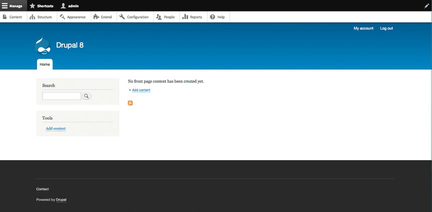
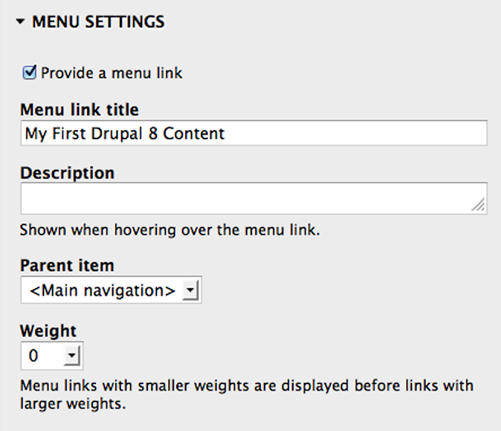
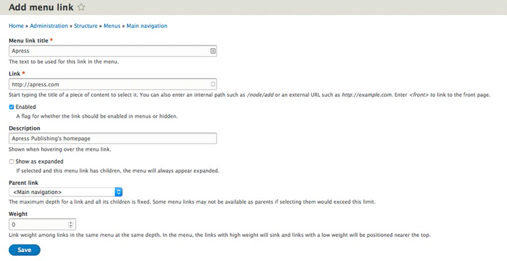
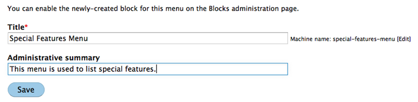

#第7章 创建菜单#
译者：勇敢的心（鑫）

>确定你的新网站成功与否的一个关键因素是，游客是否能够在你的网站中找到信息，特别是那些你希望他们找到的信息。Drupal有三种为网站提供导航功能的基本机制：

>* 能够引导用户到新页面的嵌入内容的文字链接
* 单击时能够引导用户到新页面的图像和按钮
* 文字或图片的水平或垂直的链接菜单

>在本章中，您将学习如何使用Drupal的管理员界面来创建和管理菜单。

##菜单排序##
菜单的最简单的形式，是将用户引导到一个新网页或网页的水平或垂直的链接列表。
如果你检查你的新网站的首页，只在这个页面上你就会看到至少六个菜单。参见图7-1。

图7-1 网站上的菜单

从上到下，网站上的菜单是

* 管理菜单，包括“管理（Manage）”等;
* 页面顶部的子管理菜单栏，包括“内容（Content）”等;
* 用户帐户菜单（标题栏顶部），包括“我的账户(My account)”和“注销(Log out)”;
* 主导航菜单，包括“首页选项卡(the Home tab)”等;
* 左侧栏中的工具菜单，包括“添加内容(Add content)”等;
* 页脚菜单，包括“Contact（联系表单）”等。

菜单帮助网站访客了解（和访问）该网站提供的内容，特色和功能。在这本书中，我们创建的示例网站上，显示的菜单都是文本链接。Drupal 8还提供了创建基于按钮和/或图像的菜单的机制。创建菜单是通过Drupal8内核中的一组页面完成的。创建菜单以及菜单上的项目有三个基本活动：  

* 添加一个项目到已有的菜单。 Drupal 8自带一些已经创建好的菜单。你需要做的就是为这些菜单添加项目。
* 创建一个新菜单。如果Drupal 8自带的菜单不能满足需求，你可以自己创建一个新的菜单。
* 将菜单分配在页面上的区域中。如果你创建了一个新的菜单，你需要为将分配一个页面上的区域内。

##为菜单添加项目##
两个可以添加到我们的页面上作为菜单项的通用项目:
指向我们网站中现有元素（一个页面，一个内容项，一个与分类项相关联的内容列表，等等）的链接，或者指向网站外部的链接（例如，www.drupal.org）。

**为菜单添加内容项**  
为菜单添加项目的两种方法：  

* 最好的做法是使用内容创建页面（参见图7-2），或者，本书后面将提到的，其他元素的创建页面，如面板页面或视图。之所以使用这种方法，是因为当你删除该内容项目时，Drupal将自动从相应的菜单栏中删除该项目。当你使用菜单管理页面来手动创建一个菜单项时，作为网站的所有者你必须记住，从菜单中手动删除该项目。
* 你也可以使用菜单管理页面创建菜单项，或者创建或编辑内容的时候,直接在表单中创建菜单项 。

图7-2 为菜单添加项目

要创建一个新的内容项，单击您的网站首页上（假设你是以管理员身份登录的）的任何“添加内容(Add content)”链接，然后选择“基本页面(Basic page)”内容类型。比如, 为新创建的内容类型输入标题和正文,然后点击右侧的菜单设置链接,之后选中"创建一个菜单链接(Provide a menu link)",就会显示出定义菜单的表单（参见图7-2）。输入你希望该项目出现在菜单上的标题，并在“父项(Parent item)”下拉列表中选择“主导航”界面，这里是你希望该项目出现的位置。在输入菜单项的值后，点击页面底部的“保存和发布(Save and publish)”按钮， Drupal将显示您刚才创建的页面，与该页面相关联的菜单项也会出现在该页面左上角的主导航菜单中。在网站的任何一个页面,只要点击这个链接, 就会直接跳转到我们刚刚创建的页面。 

##为外部网页添加菜单项##
您可以通过添加一个菜单项来添加通向外部网站的菜单项。要做到这一点，点击页面顶部的“管理（Manage）” 链接，并点击子菜单中的“结构（Structure）”链接。在“结构（Structure）”页面上，单击“菜单（Menus）”链接。在“ 菜单（Menus）”页面上，单击主导航菜单中“编辑菜单（Edit menu）”按钮旁边的三角图标，并选择“添加链接（Add link）”选项。然后你会看到“添加菜单链接（Add menu link）”的页面（见图7-3）。输入标题（此例中，我使用了Apress），链接，这是我们要链接的外部页面的完整网址(在这个示例中我使用了 http://apress.com )，确定“已启用（Enabled）”复选框被选中，而且出于演示的目的，从在“父链接（Parent link）”下拉列表中选择“主导航（Main navigation）”。

图7-3 为外部网页添加菜单项

输入所有值后，单击页面底部的“保存(Save)”按钮（可能需要向下滚动才能看到它）。 Drupal将显示分配给主导航菜单的菜单项的完整列表，包括我们刚刚创建的新项。通过点击管理菜单中的“返回网站(Back to site)”导航链接回到你的网站的首页。 现在你可以看到刚才添加的新菜单项。点击该菜单项将带你到你在创建菜单项时输入的外部链接。
 
##创建一个新菜单##
有时Drupal8创建和启用的标准菜单不足以满足你的需求，这时你就需要创建新的菜单。举个例子，当为公共图书馆创建一个基于Drupal的网站时，我经常被要求为图书馆中每个部门创建独特的菜单（Adult Services，Youth Services，Teen Services，Circulation等等各一个菜单）。在这种情况下，Drupal 8附带的基本菜单不能满足该图书馆的要求。要创建一个新的菜单，单击你的网站任何页面顶部的“管理（Manage）”链接，选择子菜单中的“结构（Structure）”链接。在“Structure”页面上单击“菜单（Menus）”，并在“Menus”页面点击“添加菜单（Add Menu）”链接。这时将显示用于创建一个新的菜单的页面（参见图7-4），输入菜单的标题和说明（可选），单击“保存(Save)”按钮，现在你有了一个新的菜单，接下来就可以使用本章前面描述的方法来为它添加项目了

图7-4 创建一个新的菜单

保存菜单后，您就可以为它添加项目了。作为练习，使用“为外部网页添加菜单项”这一节中所述的过程，为下面的外部链接创建菜单项：apress.com，yahoo.com，google.com和bing.com。完成后，你的菜单应该如图7-5所示。

图7-5 您的具有项目的菜单

这时，该菜单中就在 Drupal 上生成了，但它还没有被分配到页面的某一区域，因此它对网站访问者还是不可见的。为了使你的菜单可见，点击任意页面顶部的“管理(Manage)”链接，并点击子菜单中的“结构 (Structure)”链接。在结构页面点击“区块布局(Block layout)”链接。在“区块布局(Block layout)”页面，向下滚动直到你在该页面右侧“放置区块(Place blocks)”一栏中找到特殊功能菜单（Special Features Menu ）（参见图7-6）。

图7-6 “Block layout”页面

单击“特殊功能菜单”链接，将打开“配置区块(Configure block)”的页面（见图7-7）。在该页面选择您希望菜单出现的区域。假设你正在使用 Bartik 主题，选择 Sidebar Second 选项，然后单击“保存区块（Save block）”按钮。有关 Bartik 主题中可用区域的概述，请参阅第六章。

图7-7  为特殊功能菜单分配区域

点击屏幕左上角的“返回网站（Back to site）”按钮返回到首页。瞧！你的新菜单出现了（见图7-8）。现在，您可以进行分类啦。

图7-8 特别功能菜单出现在首页上

#总结#
>在这一章，介绍了向菜单添加链接和创建菜单的基础知识。我解释了为菜单添加内容项目和添加外部网站链接的过程。我还介绍了如何启用新的菜单，使其出现你的网站上。
 
>在下一章中，我会进入区块，讲解将各种各样的内容和图像导入网站的基础知识。