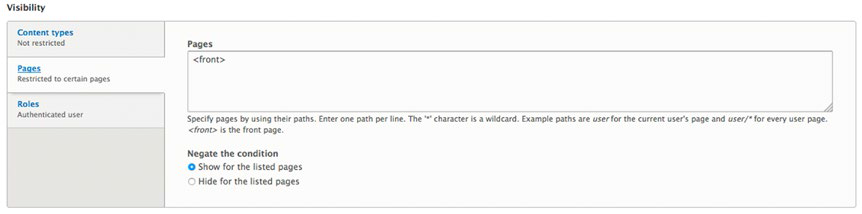
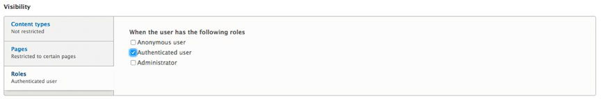
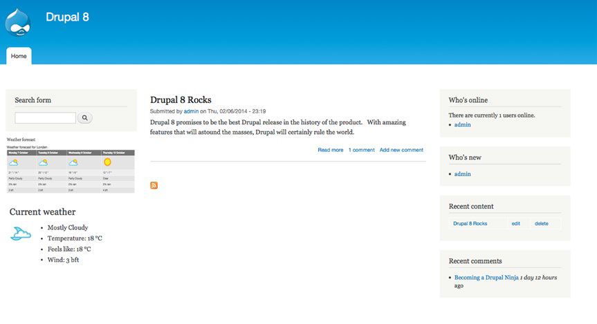

# 第8章 Drupal 区块

>在本章中，我重点介绍如何使用块将内容和一些“小部件”（包括用户登录表单，最新的博客文章，当前登录到您的网站的列表，目前天气情况，等等）放入特定位置。我将介绍Drupal8的标准区块，贡献模块附带的区块，以及如何建立一个全新的自定义区块的信息。在本章的最后，你可以使用这个令人兴奋地功能创建页面内容。

## 区块

区块是一个通用术语，适用于自己包含的内容，菜单，或者代码。Drupal 8有一些附带的标准预置区块：“用户登录”区块，搜索区块，“谁在线”区块，“最新用户”区块，“最新内容”区块，等等。也有其他贡献模块附带的区块，例如块共享最新的天气报告的区块，你最近Twitter的职位申请区块，或你当前的Facebook状态区块。作为网站管理员，您可以构建自己的自定义区块，如即将到来的事件列表。

## 在页面上使用区块

在第6章我介绍了主题的结构和主题如何在页面定义“区域”。图6-1展示了主题被分成第一边栏，第二边栏，精选热门，内容，和其他几个区域。现在我会告诉你如何把一个到几十个区块分配到主题的各个区域。并解释这样做通过提供有趣的、高价值的功能增加你的网站访客的兴趣。
图8-1是在一个页面上用区块被分配各个区域的一个例子。这个页面有七个区块。



Figure 8-1. 看看你是不是可以发现这些区块

这个例子包括一个菜单区块（导航栏），交互式区块（搜索框和用户登录），和信息区块（谁是新用户，最近的内容，最近的评论和Drupal技术支持）。  

让我们来看看Drupal8附带的区块，并把这些区块分配在你网站的区域内。然后，我们将安装一个或两个能提供简单区块的模块，您可以添加到您的网站，然后我们将从头开始创建一个全新的自定义模块。

## 找到可用的列表

在你的网站上去找可供你使用的模块列表，点击页面顶部的“管理(Manage)”链接，然后点击二级菜单中的“结构(Structure)”链接，进入到结构页面。在结构页面，点击“区块布局”链接，显示了“区块布局”页，页面上列出了你系统上所定义的所有区块，其中有些已分配到某些区域有些尚未分配。见图8-2。


图8-2 “区块布局”页面

在“区块布局”页面中，您会看到的Drupal8提供的一些可以放在网站网页上的预装的区块。在页面的右边一栏，从区块列表中选择“放置区块”框中的几个列表项。点击区块的标题，在“配置区块”表单页面，从选择列表中选择一个区域（例如，如果你使用的是Bartik主题首先是选中第一边栏，）。分配区块的区域后，点击“保存区块”按钮。如果您返回到网站首页，你会在已分配到的指定区域中看到你激活的区块。

## 重新排列区块
有时候，你可能想要重新排列页面上的区块位置。在前面图8-1所示的例子中，我们想要让“最新内容”和“最新评论”区块出现的“最新用户”区块上面。要重新排序区块，如前节所述定位到“区块布局”页面。在“块状布局”页面，如图8-2所示，只需点击并按住要移动的区块旁边的加号（+），将该区块拖动到它将要显示的区域的列表中的指定位置。当您松开鼠标按钮时，你会看到Drupal的重新排列成果（暂时性的），您将在区块说明列表的顶部看到一条消息，“你有未保存的更改。”滚动到页面的底部，并点击“保存区块”。Drupal将保存更改并显示该消息。通过点击页面左上角的“返回网站”链接返回到首页，你会看到重新排序后的区块。

## 重新分配和停用区块
Drupal还提供了一种机制，可以把一个区块移动到不同区域，也可以将已激活的区块停用。要进行更改，导航到“区块布局”页面（结构➤区块布局）。  
在“块状布局”页面（参见图8-2）中，在已激活区块中点击对应的区域列表，在下拉列表中找到<无>选项。紧接着选择<无>，该项目将从“区块布局”页面的区域消失，将出现在页面底部中的禁用部分。接下来，单击您已分配到某一区域的区块对应的区域列表，并从选择列表中选择与之前不同的区域。选择新的区域后，你操作的模块将会移动到新分配的区域列表中，并且会显示在列表的顶部。进行更改之后，滚动到页面的底部，并点击“保存区块”，它会将更改提交到Drupal数据库。回到网站首页，你会在页面看到你刚才所做的更改。

## 配置区块

您可以在“配置块”页中选中不同的配置对区块进行设置。配置选项包括重写区块的标题和区块的基于几个可选参数的可见性的设置。作为你可能会在将来使用这些功能的例子，让我们来修改“谁在线”区块，使其只在您的网站的首页上显示，只有当访问者是使用ID和密码登录的系统用户才可见。为了改变这些，导航到“区块布局”页面，并定位到“谁在线”区块。如果你还没有为那个区块分配区域，先按照上一节中的步骤分配好。接下来，单击该区块的配置链接，打开区块的配置页面，参见图8-3。


图8-3 “谁在线”区块的配置页面

在这个表单页面，你可以覆写当模块展示的时候“谁在线”这个标题是否显示（取消“显示标题”复选框），指定多少用户将出现在新进用户的列表中（每区块的项目数“Items per block”），通过选中覆盖标题来覆写标题，当你点击复选框后，在出现的文本字段中输入新的标题，并将该区块放置在一个新的区域。

你可能希望这个区块只出现在网站的某些页面上。默认情况下它是出现在每一个页面的。例如，你可能希望“新进用户”区块只出现在网站首页，在“配置区块”页面底部（参见图8-4），你在“可见性”部分会看到“页面”选项卡。要设置区块只显示在首页，点击“为下列页面显示”单选按钮，在文本框中输入<front>（<front>是用来表示网站首页的特殊术语），你也可以通过在文本框输入页面链接来制定其他页面（如/content）。  
  
图8-4 选择可见性设置  

也可以设置一个区块使它只在特定角色的特定类型用户访问时显示，点击“角色”标签，通过用户角色选项检查和设置可见性。例如，我们设置该模块只在用户登录后访问网站才显示。（参见图8-5）。  
  
图8-5 选择基于角色的设置

点击“已登录用户”复选框后，你可以点击页面底部的“保存区快”并返回到网站首页。

为了测试你的更改，进入一个首页以外的页面，你会发现“谁在线”这个区块不再显示了。退出登录返回首页，你会发现“新进用户”这个区块不再显示，因为你不是已登录状态。

## 使用贡献模块中快

确实有数以千计贡献模块可用于Drupal。这些模块以区块的形式作为向访客展示信息的主要方式，如当地天气。如果该模块已在您的网站上安装并启用，由该模块生成的块将出现在“区块布局”页面上。只需简单的把需要的区块根据本章前面所述放在相应的区域即可。如果您尚未安装该模块，按照第11章所列的步骤进行安装。

采用贡献模块区块的一个例子是Wunderground天气区块显示的天气预报（见图8-6）。

  图8-6。伦敦的天气（或任何其他城市！），现在可在你的网站上显示  
有数以百计的模块会生成区块。访问www.drupal.org/project/project_module浏览列表。
  
## 创建自定义模块  
  
有可能是你需要一个块，甚至浏览了贡献模块列表后，你无法找到任何符合您特殊要求的模块。在这种情况下，您可以创建一个自定义模块。自定义模块可以包含静态HTML和JavaScript的任意组合并且可以像下面的或更复杂，你想让它成为哪样都行。
 
为了演示创建一个自定义模块，我们将创建一个显示的“Hello World！”的例子，静态HTML文本虽然它可能不会是那么令人兴奋的，但是它确实说明了创建一个新块的过程。第一步是定位回到“块状布局”页面。一旦出现（参见图8-2），点击页面左上角的“自定义块库”选项卡。在“自定义块库”页面，点击“添加自定义模块”按钮。
  
  
   
### 创建

图8-7。自定义块的块设置


保存块后，点击页面的顶部的“阻止布局”选项卡，在自定义类别下“放置块”对话框中寻找新建立的块。点击你创建的块的名称然后分配到页上的区域。单击“保存块按钮”，并返回到您的网站主页，你会看到在你所指定的区域上创建的块（见图8-8）。

## 总结


块是用于让创建和显示在您的网站动态内容和互动功能增强的强大的机制。在本章中，我们探讨了Drupal8附带的块，使用贡献模块，以及如何从头开始创建一个自定义模块。在下一张中，我们将继续介绍其他主题来使用块。


----
   本文由Athena 负责翻译,我最终整理成Markdown 格式 .

  
  
  
  
  
  
  
  
