# 第九章  视图

翻译：peter

## 视图 

 如果你问使用过Drupal一段时间的人，什么是杀手锏模块。这个答案很可能是视图，面板，或者自定义内容类型。在这个列表中，视图通常是最先提到的。很多用户说不能没有视图模块。视图模块有什么特别的地方昵？简单的说，视图为你提供了一个易于选择和操作的界面,用于显示在你网站的内容列表。

你可能使用的视图示例

* 在你的网站显示最新发布的文章，通过时间进行升降排序。
* 在一张表中列出许多公司的地理位置，通过点击公司地理位置，城市，州和国家的标题进行排序
* 显示图片库
* 显示幻灯片
* 显示日历
* 显示博客文章列表，并通过主题进行筛选
* 创建一个RSS feed，呈现你的网站最新发布的最新内容
* 显示你能想到的任何类型的的列表，创建表单和内容并储存在你的网站中，像列表，RSS feed，在第五章中，我们创建事件内容类型。让我们创建一些时间列表，并把它放在工作中。将对访问者使用视图模块是有帮助的。如果你没有完成第五章的。现在是一个极好的时间回到第五章。通过实例来工作。以便于有所需的内容来支持你将来的活动。

## 视图模块

视图模块在Drupal8中是核心模块，默认情况下已安装并开启。
为了验证视图模块已经安装并开启，点击页面上的管理链接中扩展选项中的子菜单。在扩展页面搜索功能。输入视图进行搜索。如果这个视图模块存在，你应该看到2个模块列表 如图 9-1 所示。如果复选框没有被勾选。请勾选并点击"保存配置"按钮。

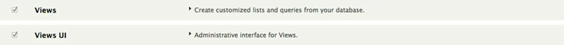

			图9-1。验证查看已安装并启用
			
这个视图模块是幕后组件。用来从处理数据库中的读取的内容，并显示出来。这个视图UI模块，UI在这代表用户界面。是管理员创建和配置形成视图界面。我们将在本章其余的部分来讲解视图UI。

## 创建一个视图

随着视图的安装并开启。我们已经准备好了。但是一个视图没有内容，那么，它仅仅是一个空白页。所有第一步创建一些内容。在本章我们已经有几篇先前创建好的文章。所有让我们使用这些作为我们首次涉足的观点。如果你跳过前面的练习或者已经删除那些你创建的文章。然后在花一点时间创建几篇。

我们现在已经创建一个文章列表的视图。点击页面上的管理链接，再点击二级菜单结构链接中的视图链接。它将跳转到视图管理界面。你将在页面上看到几个已有的视图。这些视图是Drupal的核心组成部分，提供最新的内容列表，最近的评论，新用户，谁在线，以及其他的信息。如果你通过第八章的学习，你会认识到这些视图。像这些视图，我们会在这一章节使用几个区块来展示。

要添加一个视图，在页面上点击“添加新的视图”按钮。在这页它展示了一个新的视图(参见图9-2)。定义如下：

* 视图名称：这个名称必须是唯一的(尚未在网站中另一个视图中使用)。选择一个描述名称是一个好主意，让其他人看到这个列表描述可以更轻松正确的使用描述名称。对于第一种视图，用最近的文章最为名称。
* 说明：这又是一个字段，你可以使用它来提供更多视图信息。勾选旁边的描述复选框，然后输入“网站上发布的的最新文章列表”。
* 查看设置：这组字段定义将由什么类型的内容来呈现视图。如果你点击展示列表，你将看到不同的选项，例如内容，日志，文件，评论，内容修改版本，分类(术语)，和用户。我门的观点聚焦在文章类容。在标记字段限制我们的提供的视图仅仅包含这些条款。我们将跳过标签字段到排序选项。选择未分类(我将在后面来整理这个例子)。

## 创建你的第一个视图

* 页面设置：视图提供创建内容的列表功能，在你的网站上通过一个URL访问一个单独的列表页面的的功能。出于演示，勾选"创建一个页面"复选框。你必须填写页面标题(或者保留默认值)和输入链接到列表中的URL路径(或保留默认值)。在显示的格式中，类似于没有格式化列表中的摘要，设置项目呈现10条数量。点击分页，它将呈现文章列表。如果 在文章列表超过10篇文章，一个分页器将出现在文章列表底部，以便于浏览者查看所有的文章，每页仅显示10篇文章。
* 区块设置：虽然我们学习了区块在第八章。但是出于学习的目的。我们将允许我们的视图创建一区块(放在一个页面的任何地方)。显示该区块最新的三个事件。点击"创建一个区块"框，输入区块标题名称(或保持默认值)，将保留格式保留为格式化标题列表名称(链接)。将项目组第三个“使用这个”复选框选中。

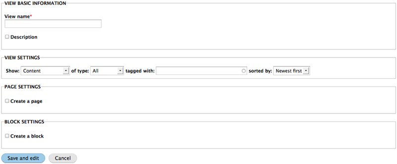

				图9-2。创建新视图	
				
点击“保存并修改”按钮。会跳转到下一个配置视图页面。如图9-3所示。

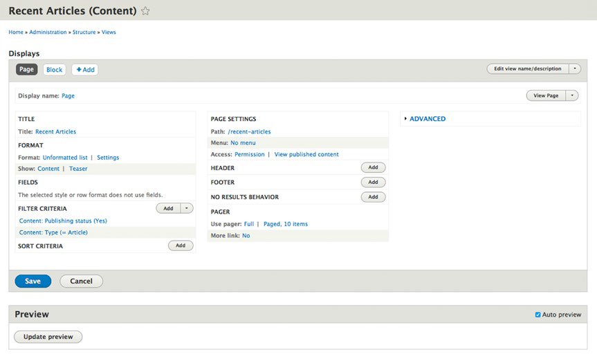

				图9-3。视图编辑页面
				
乍一看，定义一个视图的形式看起来很复杂，幸运的事，这是表面的假象。

首先你将会看到视图配置上的一个列表，在我们的例子里，我们有一个页面和一个区块。视图的强大功能之一是一个单一的视图可以呈现多个显示的功能。我们可能会使用的最近的文章类型作为例子，它包括：

* 在网站上显示所有文章，并显示每一篇发布的文章详情。
* 一个区块列出最近5篇文章，每一篇文章只显示的标题 
* 另一个区块显示最近5篇文章，每一篇文章显示的标题和内容简介
* 还有一个区块显示最近10篇文章，显示文章的标题，发布日期，编写作者和内容简介。

这是一个简单的视图用于创建几种不同内容类型，每个类型在文章中都呈现不同的格式。

我们将开始定义2个显示区，页面和区块。当我们第一次选择配置视图(参见图9－2），它们将通过视图自动被创建。通过前两个步骤的工作，我们将添加到显示列表。

##页面显示

首先让我们定义这个页面显示。点击页面显示配置下面的页面按钮，在页面之上我们将完成文章的标题，内容，作者，发布状态和时间及日期。让我们从上到下，从左到右配置我们需要的页面显示参数。

1. 从修改页面显示的名称到更多的描述，像"所有文章页面"，到改变这个值，点击"页面"右侧的页面名称。并在弹出框中的管理描述字段输入新的值。接着点击应用按钮。我们将看到这个新的值.呈现在视图编辑区域并左侧栏位"显示名称字段"视图名字字段的左侧栏。
2. 在这个区域，改变视图的的标题，这个值会在视图顶部直接输出。然而让我们改变"所有文章"。点击"最近的文章"，从列表中选中"此页面(覆盖)"，这个意味着我们改变的这个值仅仅应用这个特别的视图显示。如果你设置成"显示所有",每一个视图都将显示这个新的标题。因为不同的目的，我们会有不同的显示。"所有文章"在选择标题后，对其他显示器是不友好的。
3. 在格式区域。我们可以使用有不同的输出生成一个列表。点击"格式化的列表"会看到一个输出格式列表选项：

	* 网格(表格)：输出显示行和列。在我们的例子中，每一篇文章将填充一行网格(表格)。对于图片库显示图片这是一个好的选择。
	* HTML列表：输出一个有序或者无序列表。在我们的例子中，每一篇文章将会显示在列表中封闭的"__ol__ __li__" 或者 "__ul__" 标签内。如果没有类似的HTML标签，如果你不熟悉HTML标签,在<http://www.w3schools.com/html>查看这个伟大的教程或者拿起一本伟大HTML开发入门书籍在<http://www.apress.com>。
	* 表：作为一个HTML输出显示。每一个字段显示一列。当你想提供一列的值来排序输出表，这是一个好的表。
	* 没有格式化式化的列表：作为一个列表显示，但是不像HTML列表，这儿没有 __ul__ , __ol__ 或者 __li__ 标签。在我们的页面例子中，我们设置无序列表。当改变这个值除了"没有格式化列表",记住在这个列表中选中"此页(覆盖)".如果你点击设置右侧的"没有格式化的列表"，你将看到这个配置所有的有效的类型选项。每一个参数都有自己的选项供你设置。
4. 在格式部分，我们定义了参数要如何处理我们想要展示的内容。内容和字段时最常用的内容选项。
	* 内容：显示当前正在选择的完整实体。在这些文章案例中，这个完成的文章将被展示出来。
	* 字段：使你显示特别的字段的实体进行渲染。在我们的例子中，我们正在选择和现实的文章。我们可以有一个我们想要展示的文章标题和发布日期视图。使用字段选项，我们可以展示特别的字段，以及这些字段在页面的显示顺序。在我们的页面例子中。我们将选择内容展示。像摘要，一个文章截取版本，显示600字符集。当我们在摘要模式定义了我们要设置的页面显示内容。所有展示我们已经设定的值。如果我们想要通过这个视图来渲染这个实体文章。我们点击这个摘要文字，在视图模式列表中默认为"默认值"中选择。对于我们示范的目的，在显示模式中设置摘要显示。
5. 在我们的例子中，这个字段配置参数没有被显示，因为我们将显示整个文章。在本章的后面，我们创建显示区块，我们将覆盖这些字段。
6. 过滤标准在下一个配置区域。你可以通过添加视图显示的过滤标准，来渲染这个内容显示。当我们创建这个视图(参见图9－2)时，在第一个配置屏幕上，我们选中这个视图，并设置仅显示文章。通过选择文章，我们设置了一个过滤仅仅显示文章内容类型。此外，视图也为发布(未发布)的内容创建过滤条件。在我们的视图中我们会添加别的过滤标准；例如，在文章案例中，我们可能想一个显示视图仅仅展示最近30天发布的文章。我们可以通过添加任何一方面的过滤标准来限制储存在项目中值的输出。出于演示的目的，我们将单独设置过滤标准。当我们创建显示区块时，在本章之后将覆盖添加的的过滤标准。
7. 这个排序部分提供了特定的内容列表排序。在默认情况下，这个值将通过节点ID(通常在Drupal内容项目中的唯一标示)的顺序排序。你想要设置一个标题排序标准，按照这个列表你想按照字母排序，或者通过最新发布的文章列表的日期排序。让我们在标题中添加一个排序标准。点击排序标签右侧的添加按钮，你将在你的网站上看到你定义的所有字段的一个完整列表，我们想要过滤这个列表名字中的"标题"字段。这样做，进入"标题"来搜索字段和在列表字段中选择"内容：标题"，向下滚动，知道你发现"内容：标题",检查该字段的复选框，在本页顶部选择之的改变，然后点击"应用"按钮。在下一个屏幕允许设置这个排序，上升或者下降，也向网站访问者公开这个选项。在这个实例页面中，不检查没有选择的复选框。我们想要按照这个标题排序。点击"应用(显示)"按钮继续。滚动到屏幕底部，你现在应该看到这个页面将如何输出显示。在第二列的配置选项里（参见图9-3），我们将开始为我们的列子定义页面设置。
8. 每个显示视图作为页面被定义，并且有一个唯一的URl。特别是路径字段中。在我们的例子中，让我们用"/all-articles(全篇)"作为URL。点击"没有路径被设置"，在这个"这个菜单路径或网址"表单输入所有文章路径文本字段。点击应用按钮继续。
9. 菜单字段提供给我的选项来添加我们的视图显示页面到一个菜单。出于演示的目的，我们将添加它到这个"主导航"菜单。点击"无菜单"参数，然后点击"普通菜单"选项。在这个配置页面添加菜单项，输入标题，描述和选择"主导航"菜单作为这个项目菜单。对于你的网站建设，你可能想要作为一个菜单添加到一个视图页面而不是"主导航"菜单.在表单上输入值后点击应用按钮。
10. 视图提供了限制谁能看到这个输出的显示视图。你可以设置的访问限制
	* 无：任何人都能看到输出。
	* 权限 ： 这个访问者必须是被分配一个有权限角色才能看到输出。
	* 作用 ： 这个访问者必须被分配特别的角色才能看到这个输出。
	通过定义这个被设置的权限。这个默认权限是访问者要有访问网站视图内	容的权限（见图9-3）。在大多数默认值是合适的。在我们的示例页面，	我们将把他们设为默认值。仅仅有权限的访问者能看到视图内容输出。
11. 在头设置，你可以在你的视图顶部添加一些东西。例如，你可以创建一个介绍性的段落，通过内容描述渲染视图，或在你网站上定义一个区块，输出另一个视图，或几个其他元素。点击添加按钮和选择列表中的选项。大多数相同的选项添加到介绍性的段落，这样做，点击"全局：文本区域"选项，在选择列表的顶部选择"这个页面(覆盖)"选项。点击"应用(所有显示)"按钮。在下一个表单中，输入你想要在视图中显示的文本。如果你想在头部文本显示即使在你的视图中没有值，勾选这个"显示视图没有内容"的复选框，然后点击"应用(所有显示)"按钮。
12. 底部设置，像头部一样，你可以添加一个底部设置输出视图，然后像设置第11步一样添加一个底部视图。
13. 如果你的视图没有内容。例如，在你网站上没被发布的文章——你可以提醒访问者，在你设置之前提示没有内容存在的消息。创建消息跟创建头信息和底部信息一样。当没有内容时按照步骤11添加一个信息。
14. 如果你的视图返回一个很长的列表。考虑到在底部视图使用的分页。限制显示的数量在任何给定的时间范围。例如，一个视图可能返回100个内容项，而不是显示所有100个内容作为一个很长的列表。你可以使用分页展示，一次显示10项，分页显示在视图显示内容列表底部，这个分页配置选项也提供特别的数量项(例如，3个最新文章)，或列出所有适合的筛选条件列表项。在第三列（参见图9-3），有几个高级配置选项，我们将关注其中2个，要显示的选项，点击高级配置选项。
15. 上下文配置器时一个功能强大的配置选项，允许你利用网页中传递的值，进行过滤，返回给的视图。例如，我们希望限制返回我们所标记过的特定的分类文章。如果我们的文章内容类型有"事件"分类词汇作为一个字段编辑用于特别的分类文章相关联，我们会使用网站传递的值来过滤文章的显示。通过选择的一个上下文过来"已有的分类项ID"，然后为文章设置内容类型，分类词汇和过滤值类型转换成项目名字或项目ID，你现在可以更新这个路径成" __全部文章/%__,这里的"__%__"代表通过网址传递过来的一个值。我们可以认为有一个视图可以通过分类词汇显示任何文章。这个单一的视图可以通过"__/all-articles/drupal__(/所有文章/drupal)"来渲染关于Drupal文章列表。或者通过__/all-articles/dinosaurs__(/所有文章/恐龙)，或者是我们的分类词汇的任何一种术语。很神奇吧！为了简单起见，在我们的例子中不使用上下文来过滤。
16. 在案例中使用关联，你需要从2个不同内容类型来满足特定的视图要求。例如，你有一个类容类型，列出来地址，操作时间和辅助选项。而不是每个事件上键入的信息都在发生在那个地方。 你可以在事件内容类型和地点内容类型之间建立关联，使两个内容类型中存储的信息结合起来，这样可以代替在每个某地的事件中添加信息说明。你已经在你的显示视图中内容类型创建过一次有效的关联字段。因为我们很简单，我们现在设置这个关联。在这一点上，我们准备测试我们的视图。运行程序之前确保你点击了保存按钮。在保存之后，返回到你网站的首页，然后你应该在你的主导航菜单看到所有的文章链接（如果你使用Bartik主题，他应该在屏幕上出现一个标签）。点击所有文章链接(或标签)，你将看到你的劳动成果(参见图9－4)。

## 区块显示
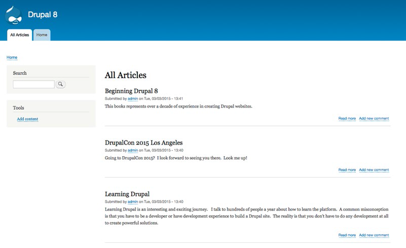
		
				图9-4。所有文章查看页面
				
### 区块显示

随着文章页面显示我们的所带的区块，现在让我们修改这个区块显示。通过导航到管理 》结构 》视图 返回管视图理页面。查找最近的文章视图，点击操作栏中的编辑链接。你现在应该看到最近的文章视图配置页面（参见图9-3）。

在这个过程中的第一步时点击视图列表中的区块按钮。你应该能够直接找到文章页按钮。点击区块按钮显示区块所有配置参数，让我们来更新这个显示，让它仅仅显示最近3篇文章标题并按照发布时间排序，降序以便于最近一篇文章显示在页面顶部。让我们先从更新一些更具描述性的名称开始，接着做一些我们需要的做的来改变区块本身：

1. 在第一栏中，"显示名称"，点击区块改变"行政名称"字段的值为"最近的文章区块".
2. 设置标题为最近的文章，因为它仍然适用于所要显示的区块。
3. 设置格式化为"为未格式化的列表"，因为我们仍然想要文章显示为一个列表。
4. 改变显示选项为字段，因为我们仅仅想在我们列表中显示文章标题。
5. 在字段区域，设置显示标题选项。如果它没有显示标题。点击添加按钮，在那个区域搜索这个标题，添加到区块显示。
6. 在过滤标准区域，设置内容发布状态显示已经发布的内容和内容类型设置为文章内容类型。
7. 在排序标准区域，点击添加按钮，搜索日期。你将看到"内容：发布日期"在列表选项里。检查这个字段旁的复选框，改变这个选项值为"这个区块（覆盖）"，在底部点击"应用（显示所有）"。出现在下一个表单上，选择"倒序排序"，因为我们想在列表顶部显示最新文章文章，最旧的文章在底部。应用这些改变。
8. 最后，我们要在第二列最后三个配置选项改变值来限制文章显示数量。检查确保使用"分页"值来设置每页显示一个特定数目的项目，例如3项。"当我们设置我们特定的值在视图上"。点击保存按钮。你现在准备吧你刚刚在网站上创建的一个块放到一个页面上。页面上的导航到结构，然后点击"区块布局"链接。在"区块布局"页面上，在这个"区块地点"栏里，你可以看到你想创建的视图显示列表，见下面的（视图）列表区域，（如图9-5）。

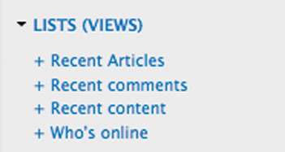
	
		图9-5。列表（视图）块

点击最近的文章：最近的文章区块链接，分配一个区域。现在列表上的一个区域后，保存这个区块。返回你网站首页。你应该高兴的看到通过你创建并使用的视图区块中的文章列表。（如图9-6）。

## 过滤

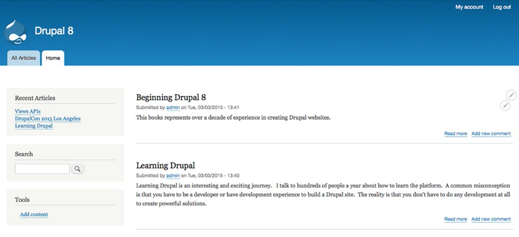
	
		图9-6。该网页显示最近的文章块列表

### 过滤

在前面的例子中，我们基于内容和发布状态过滤输出我们的视图。这些都是最经典的过滤视图显示。但是你是否想限制输出视图显示超出内容和状态？让我们以标签为例来演示过滤器的强大。在本节中，在我们网站上我们将添加一个标签例如文章。编辑几篇你的文章，在标签字段，输入几个关键字，并用逗号分开，描述每篇文章的内容。至少在你的两篇文章上使用类似的关键词以便于我们在后面的例子中使用这些文章。为了找到更新的文章，在主菜单中点击内容链接，在表单列表上点击编辑按钮添加标签到现有文章。添加标签之后，返回我们之前章节创建的文章页面。你添加的标签现在显示在每一篇摘要下面。（如图9-7）。

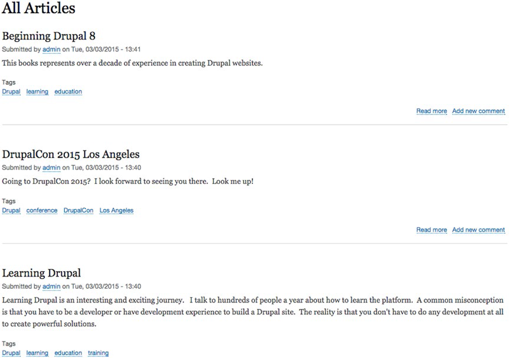

		图9-7。通过视图渲染标签
作为一个快速演示分类，标签，和视图的的能力。点击一个标签，在你网站的项目上你输入Drupal将呈现一个这个标签的内容列表。在幕后，Drupal是使用视图来生成这个列表。但是，让我们更进一步，允许用户通过输入一个标签过滤文章列表中显示的内容。

通过点击页面结构上的视图链接，回到视图管理页面。找到最近的我们已开启的文章视图，点击编辑按钮。在视图显示区域点击显示所有文章按钮配置页面。通过点击添加过滤标准添加一个新的过滤标签。在"添加过滤标准"表单上的搜索框输入"标签"搜索这个标签字段。勾选这个"内容：标签(field_tags)"字段复选框。改变选项为"页面(覆盖)"以便于只在本页面显示这个过滤标准，然后点击"应用(显示所有)"按钮。

接下来的步骤是选择过程，我们希望显示的接口类型，无论是一个下拉的选择列表，或自动在用户类型关键词搜索。这个下拉字段将会展示给用户有效的选项，而自动完成方法要求用户知道他们希望搜索的选项。该选项依赖于你的用户体验。出于演示的目的，选择下拉菜单，点击"应用并继续按钮"。

下一步时配置过滤器，并知道它是怎么工作的。我们想要允许用户选择哪一个过滤选项，这样我们将为用户展示这个过滤器以便于他们能控制这个视图的内容显示，这样，点击勾选"显示这个过滤器给游客，允许他们改变它"选择框。设置为"过滤类型"设置为"单一过滤"，改变这个标签"选择一个或多个标签"。设置为"其中之一",这意味着我们想要用户仅选择从网站上存在的文章标签值。还要检查"多选"框，来允许访问者选择多个标签进行搜索。点击应用按钮继续这个过程(如图9-8)，然后保存这个视图所作的更改。

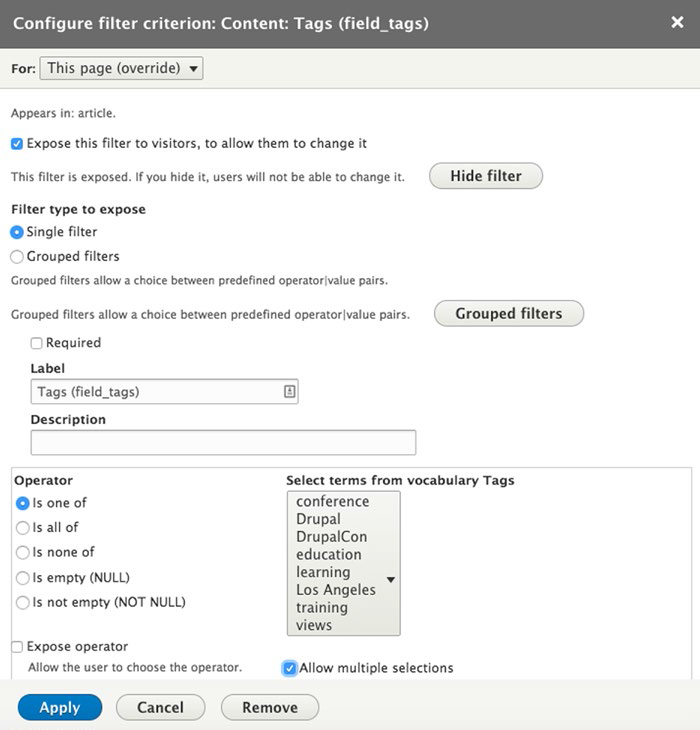
		
		图9-8。配置过滤器
		
在主菜单上通过点击所有文章链接回到本文章页面。或在你的网站上访问这个*/最近的文章*URL。你将在你的文章列表上看到你显示的过滤器。选择一个或多个标签，然后点击应用按钮将看到一个新的过滤器方法(如图9-9)。太神奇了！你触及到视图能为你做的表面。

##高级视图输出

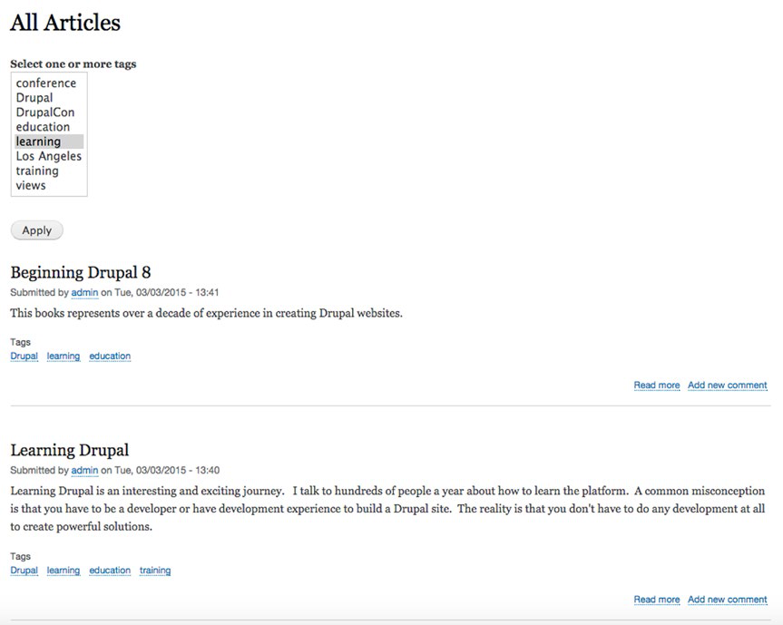
		
		图9-9。基于用户输入滤波输出
###高级视图输出
在视图中创建内容摘要和字段列表是最常用的用法。但是，如果你停留在那里，你可能会错过更多强大的功能。在这个区域，我会说明当我们建立Drupal网站期间遇到的常见场景。

创建RSS订阅

一个常用的视图是创建RSS订阅，一个RSS订阅是一种行业标准的发布内容格式。它通过应用被使用例如新闻、Drupal网站。而RSS订阅没有像网上主播鼎盛时期那样流行。仍然有案例使用RSS订阅意义，例如在其他网站提供订阅内容。

##创建表
让我们以最近的文章视图来为所有文章创建一个RSS订阅。首先，通过点击管理单里的管理链接回到视图页面，接着点击结构链接，最后点击在结构页面链接。找到最近的文章视图，点击编辑按钮这个视图。我们将在页面上的视图区域通过点击添加按钮创建一个显示RSS订阅。对于列表中的选项，选择订阅。接下来在输入一个订阅的将被访问的URL。在"订阅设置"区域的第二栏中，点击"不设置"链接，输入一个网址。出于演示的目的，我会输入一个*rss/articles*的URL，我也可以使用任何URL，但是我发现它在我的RSS订阅URL里面rss的前缀更明显要显示的URL是什么。通过点击应用来保存URL的改变。然后点击在视图表单底部点击保存按钮来更新视图。你现在有一个RSS订阅，在其他网站可以使用你网站上面的文章。访问这个URL显示这个订阅输出。(如图9-10)

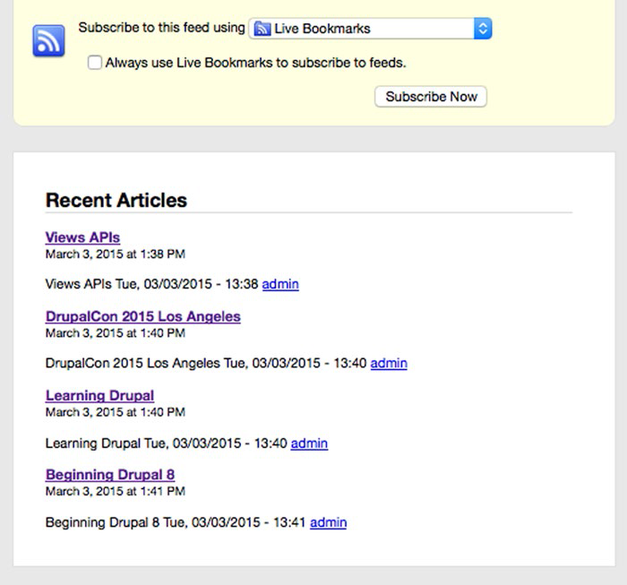
		
		图9-10。一个视图生成RSS提要
###创建表
将内容渲染为列表在大多数情况下表现很好，但是有时用户可能更喜欢内容通过表格的形式展现。出于演示的目的，回到这个文章视图编辑表单为了创建一个新的显示，将在电子表格中渲染文章字段。在视图区域点击添加按钮，选择区块显示类型。改变"显示名称"像你之前那样。这次的"文章表格"。在这个格式化区域点击"没有格式化列表"，改变表格输出显示的类型。记住在点击"应用(显示所有)"按钮之前，先改变页面顶部选项为"这个区块(覆盖)"。出现的下一个屏幕你可以设置你新的表格选项。(如图9-11)。

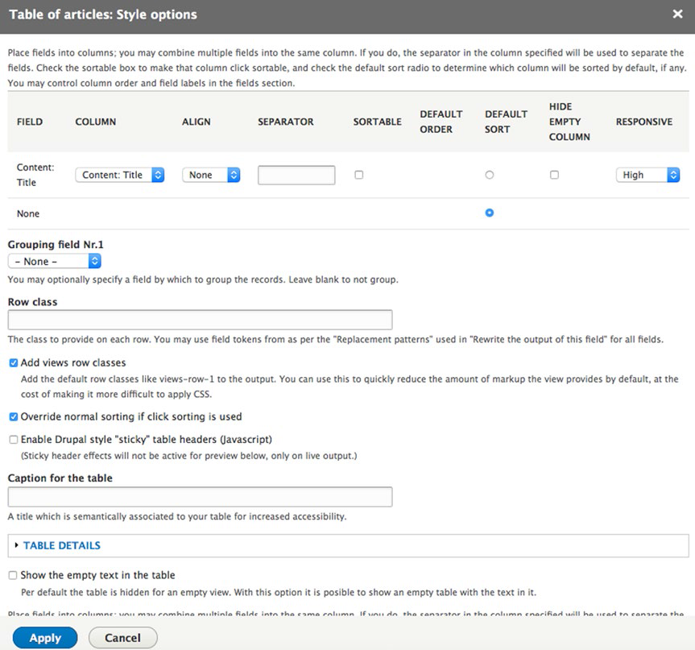

		图9-11。表样式选项
这种表单选项，你会想使用最常用的排序选项。现在我们的表格仅仅有一列，文章标题字段，但是我们必须完成这步之后才能添加其他字段。我们可能想有一个或多个这样的列有最终用户来排序。对于排序列，用户点击这列的标题，视图自动根据表格基础进行升序排列(如果用户在次点击，将为降序排列)。点击排序表格的复选框标题这列，在接下来的几个步骤中会添加别的列后我们将回到这种表单。

在下面的列表字段你会找到一个名称为"分组字段NR.1"的选择列表。在表格中你可以渲染输出这个组，就像在你表格中不同的部分，可以通过简单的选择你想要排序的分组结果的字段。例如，如果你有一个出售属性列表，你可以通过邮政编码或城市分组输出。共享一个邮政编码的所有属性将在表中单独的分离出来。出于演示的目的，设置选项为无。

##查看附加模块
这里有额外的样式选项。但是在大多数情况下设置这些选项为默认值足够了。点击应用按钮完成这个这一步。
单列的表格是无聊的。只不过是显示一个列表而已。那么让我们添加2个额外的字段来丰富表。添加一个文章发布日期字段，另一个添加该文章相关的标签.我们将添加的每一个字段作为单独的一列。要添加字段，在页面的字段区域点击添加按钮(如图9-3)，在我们的视图上展示了列表上的每一个有效的字段。为了方便的找到我们想要的字段，在列表字段顶部搜索框输入"创建"，然后在表单中会显示搜索的结果列表。选择"内容：撰写"字段旁的复选框。选择"这个区块(覆盖)"选项是为了防止这个表单字段被添加到我们创建过的别的视图中显示。点击"应用(显示所有)"按钮。在下一个屏幕会提供这个"撰写"字段的配置选项来显示。包括字段的标签显示，CSS样式选项，当一个给定的文章没有值和选项的时候，该怎么做。为这些选项设置一个默认值然后点击应用。
##视图附加模块
这个视图模块它自己是一个有利工具来展示你的网站上内容。当你结合其他特定的模块，你会得到一个全新的强大的功能。这里有几个"必须拥有"附加模块，你不妨考虑用它来构建你的网站，这儿有一些我非常喜欢的模块：

* 幻灯片视图( <http://www.drupal.org/project/views_slideshow> )：这个模块提供一个简单易用的界面，用于创建幻灯片内容显示视图。这里有许多幻灯片视图模块，但是这种是最容易使用的一个。
* 日历(<http://www.drupal.org/project/calendar>)：需要显示日历事件？这是你的模块。它提供给你一个丰富的设置工具，创建并显示任何类型的日期字段和日期值包括（年，月，周，日）。在我所有的网站上它是一个必备的模块。
* 轮播［*jCarousel*］（<http://www.drupal.org/project/jcarousel>）：我的大多数项目涉及一些轮播形式的内容显示。这个模块让创建一个内容项目列表更简单，作为它作为一个转盘轮流显示。
* 拖拽视图(<http://www.drupal.org/project/draggableviews>)：希望提供一个管理界面，允许内容编辑病在视图中重新排列这些选项。在你的视图中该模块提供一个简单拖拽界面来重组项目。
* 谷歌地图(<http://www.drupal.org/project/gmap>)：希望在地图上显示有地理(位置)信息内容？这个模块集成谷歌地图和视图，为了提供一个易于使用的解决方案，在地图上显示内容项。
* 视图数据导出(<http://www.drupal.org/project/views_data_exprot>)：希望从你的网站导出内容到一个CSV文件，电子表格，Word文档，文本文件，或XML文件中？该模块提供了这样的功能。

也有些附加视图附加模块，在这里我们没有讲到。请访问<http://www.drupal.org/project/project_module>并在右列分类列表点击这个视图链接.在写文章的时候，有756个关于视图的贡献模块！通过浏览这个列表(记得看看是否是你感兴趣的Drupal8的模块版本)。人们已经创建了许多惊人功能的视图模块。

##总结
我仅仅了解到如何在你的心网站上使用视图。视图是非常强大的。是Drupal模块中一个"杀手锏"模块之一。
到现在为止，我们把重点放创建区块内容，菜单和模块的基本组成部分。在下一章中，我们看看在使用这些元素来创建页面。

	