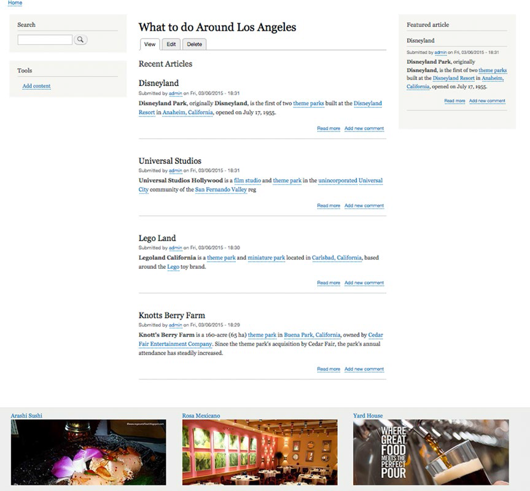

第10章:创建页面
===
（译者：Lead）
#### 概要

现在你已经对内容类型、区块、视图和主题有所了解了，你就具备了用这些元素集合到你的页面上。一个页面可能是一个单独的内容表现（例如：一个关于在DrupalCon的第一天的新闻），或者可能是一个表现一个像Drupal.org首页登录页面。
你的网站每一个页面可以用不同的结构，这要感谢你选择的灵活的网站主题以及区块机制和在哪个页面（网址URL）去显示区块的功能。使用视图创建块提供了一个动态机制，用于提取内容以及通过块接口创建的静态块。
Drupal8工具的组合提供了一个强大的机制来创建一个优秀的网站。

#### 创建页面的基础

Drupal 8核心与你的主题的结合提供了所需的所有功能，在一个网站上创建一个典型的网页。 主题提供了可以包含的内容的区域，而Drupal 8核心的内容类型，区块，和视图提供了将创建的内容放置在这些区域的机制。 
在第六章你发现Bartik主题提供的区域作为你的网站内容的容器。 作为一个回顾，图10-1描述了可用于放置内容和块的区域。

图10-1 由Bartik主题提供区域

Bartik提供了17个我们可以放置内容和块的区域，包括头部区域典型的用于表现网站标志、搜索栏和导航元素如主菜单。Bartik只是Drupal.org里数百个可用的主题之一，每个主题都有其自有的布置和区域数量。另外，你可以使用一个起始主题，如Zen主题，然后设计出你想要的布局和区域来达到你期望的网站样式。鉴于为了演示Drupal 8 的页面建设，我们将保持在Bartik主题提供的固有样式和区域中进行。

我们将创建的第一页面是一个内容的详细页面的例子，意思是一个单一的内容显示在一个页面上伴有各种相关的块，超出只是一个内容的页面。为了演示创建内容详细信息页面，我们将使用文章内容类型创建一篇描述了即将到来的DrupalCon的文章。登录后，导航到管理➤内容。在内容页中，单击“添加内容”按钮，选择文章。输入文章标题和正文文字，并点击“保存并发布”按钮。注意一下与你的文章相关联的网址编号，因为你将用它来放置区块只出现在这篇文章页面里。

此时所有被定义为整个网站范围的块都会显示在这个页面里，围绕在DrupalCon的文章周围。但是如果你想显示更多的其他有别于标准的区块和文章呢？答案是使用视图从内容来生成区块，或者用区块接口区创建或分配一个区块出现在这个页面里。让我们开始创建一个自定义区块通过“区块布局”页面并分配该块只出现在DrupalCon页面上（见第八章复习一下关于块的内容）：

1.单击顶部菜单中的“管理”链接中的按第二个菜单“结构”链接。单击“区块布局”链接以显示“区块布局”页面。

2.点击“添加自定义块”按钮来创建一个新的自定义块。

3.在“块描述”字段中，输入“DrupalCon 2015 Los Angeles.”

4.在主体里，输入“May 11-15, 2015 in the Los Angeles Convention Center.”

5.单击保存按钮。

6.在出现的“配置块”页面，找到区域选择列表并设置区域“Featured top”（如果你不使用Bartik，选择另一个突出的区块）。

7.要限制此块将出现在哪些页面上，单击竖向导航栏中的“页面”选项卡，并在页面文本区域，输入与您创建文章URL地址，以/node开始。以我的例子，那就是我写在网站上的第一篇文章，所以我会在框中输入 /node/1。接下来，单击“为下列页面显示”单选按钮，因为我们只希望这个区块出现在我们的文章页面上。

8.单击“保存块”按钮以保存新的块，然后导航到你正在工作的文章页面通过点击第二个“内容”链接菜单，然后单击内容列表中的文章标题。

在加入这个块后你应该会看到与图10-2相似内容。

图10-2。给一篇文章详细页添加一个块

我们可以继续这个步骤添加其他区块到这个页面的其他区域直到我们的内容和元素达到我们要显示给我们的目标用户当他们登到"DrupalCon 2015Los Angeles page"页的内容时。 

### 创建登录页面

登陆页面通常是一个页面，与一个单一的内容不相关，并且可以在页面上显示几个不同的内容和几个区块。
Drupal网站的主页是一个登陆页面的例子。
让我们继续为那些要参加在洛杉矶的DrupalCon的人们创建一个新页面过程。
本页将利用Bartik主题提供的多个区域去生成一个看起来如图10-3所示的页面。

图10-3 “What to do Around Los Angeles”页面

在生成这个页面的第一步是使用“基本页面”内容类型创建一个即将用到的础信息页（见第1章复习有关创建基本网页）。为了使事情变得有趣，我们只会为这一页输入一个标题，内容留空。在标题栏中，输入“What to do Around Los Angeles”，然后单击“保存和发布”按钮。我们现在有一个空白页，标题为“What to do Around Los
Angeles”，没有任何其他内容，除了一些标准的在每个页面都显示的区块。
让我们创建几个区块和视图，并将它们分配给该页以使其看起来像一个登录页。

首先我们来创建一个词汇表分类，命名为“Event”，然后在词汇表了创建“DrupalCon Los Angeles”的一个项，点击管理菜单上第二个菜单“结构”按钮。点击“结构”页里选择“分类”。在“分类”页点击增加词汇表按钮，名称里项里输入'Event'。单击“保存”按钮以显示“Event”分类页。点击“添加项”按钮，并在名称字段中输入“DrupalCon Los Angeles”创建一个分类术语。点击保存按钮以保存分类术语。 我们还需要另一个“Subject”分类词汇表。按照创建“Event”分类同样的步骤，只是这一次命名的名称为“Subject”，并添加一个名为“Things to do”的术语项。

我们现在需要一种方法来指定一篇他们正在写文章一篇“things to do around Los Angeles”文章。我们可以通过在我们的文章内容类型中添加2个术语引用字段来实现这个功能，允许作者从“Event”和“Subject”中选择。在“结构”页上，单击“内容类型”链接，然后单击文章内容类型的“管理字段”链接。按照章节5中的“Customizing Your Content Type（自定义您的内容类型”的一般步骤）”，创建两个新的参考类型字段，一个“Event”和一个“Subject”。作为复习，选择“Term Reference”作为字段类型。在字段类型设置页为每个字段选择合适的词汇表。添加两个字段的字段后，你的字段列表应该会和图10-4所示类似。

图10-4 “Event”和“Subject”字段添加到文章内容类型

下一步是创建的几篇文章，选择DrupalCon洛杉矶事件做为主题。让我们开始创建五篇文章，并使用这些文章作为创建登陆页面的基础文章。

#### 创建视图

在页面的主要内容区域，我们将创建一个列表关于5个最新发表的文章聚焦在“what to do in Los Angeles”。我们将使用视图模块创建的文章列表，使用摘要显示模式为我们的网站访问者一个介绍对每个文章并且能通过点击“阅读更多”看到整篇文章的链接。用在第9章中所述的技能，创建一个新的视图给文章，通过单击“结构”菜单项并选择视图，创建一个新的视图。点击“添加新的视图”按钮，并命名为“Articles”。我们将使用这一个视图创建多个显示来创建我们想在我们的登录页上显示的输出样式。在“添加新视图”页的视图设置区域，选择文章作为我们将显示的实体类型，保持其他剩余的选项为默认状态。单击“保存和编辑”按钮继续。

我们将创建的第一个视图显示的是最新的五篇摘要列表。单击“添加”按钮以创建一个新的显示，并从选项列表中选择“区块”样式。单击“显示名称”栏中的显示名称，将显示名称更改为“Latest Articles（最新文章）”，请单击标题栏旁边的名称区域，然后输入“Latest Articles（最新文章）”以将其显示为该视图的顶部输出名称。接下来，对显示的设置，改变显示的字段为内容并选择摘要的样式作为列表显示样式。单击“使用分页”链接，改为“显示指定数量的项目并将项目集数显示为5。最后，单击“保存”按钮。

我们将创建的第二个视图显示的是一个特色文章块。我们将随机选择一篇文章，并在页面上显示整篇文章。要创建此视图显示，请单击“添加”按钮，然后选择“区块”。将“显示名称”改为“Featured article ”标题改为“Featured Article”。确保在每个你做改变的元素顶部选择列表选择覆盖方式选择“这个Block（覆盖）”，否则您的更改将应用于所有视图显示。改变显示设置为摘要模式来显示文章的缩短版。下一步，单击“排序标准”中的“添加”按钮，并添加一个新的排序顺序。从类型下拉列表中选择“全局”样式，并从“全局”样式“值”的列表中选择“Random（随机）”，然后单击“添加并设置排序标准”。 保留不勾选“把这个排序显示给用户，让它们自己选择”前的复选框，单击应用按钮完成添加新的排序标准。下一步，删除后的日期（降序）”的排序标准，通过点击“添加链接（显示排序标准正确选择重新排列）”旁边的向下拉箭头选择重新排序。在“重新排序”页面，点击相关的内容：发布日期（降序）”的"删除链接”按钮并点击应用按钮。接下来，改变分页区域连接的数量显示由5项改到1。最后，单击“保存”按钮。

我们将把我们所创建的2个区块分配给“What to do Around Los Angeles”页面来演示我们的劳动成果。单击“结构”链接，选择“区块布局”链接。在右边的列中，你会看到可用的块列表的地方。在“列表”（视图）部分中，您将看到我们刚刚创建的2个模块。点击文章：精选文章链接并将其分配到“侧边栏”区。单击“显示页”选项卡，然后单击“显示”按钮。在文本区域中输入网页的网址。在我的情况下，我的关于“在洛杉矶可以做什么”文章的网址是在/node/7，所以这是限制这一块只在这一页显示的价值，限制这一块只在这一页显示。单击“保存”按钮。做相同步骤对最新文章：最新文章，但在这里我们选择内容区域。最后，单击“区块布局”页面底部的“保存块”按钮。接下来浏览“What to do Around Los Angeles”的页面上看到我们的网页建设工作进展（见图10-5）。

图10-5。网页建设进展

我们将把登录页用三个附加的精选文章块包围起来，通过增加三个额外的“洛杉矶周边餐馆”文章。我们将显示为每个餐馆上传图片到临近页面底部的Featured Bottom区域内（参见图10-1区域位置）。

我们首先需要添加一个新的“Restaurants”术语到“Subject”分类词汇表里，这样可以过滤文章通过使用“DrupalCon 2015 Los Angeles”的“event”和“Restaurants”作为“Subject”的过滤条件。重复你之前的步骤（在4章）通过对结构➤分类，点击“Subject”分类向下箭头列出项目，然后点击添加新项。在“名称”栏中输入餐厅，然后单击“保存”按钮。

下一步是创建内容。单击第二个菜单选项“内容”的链接，然后单击“添加内容”按钮。选择文章内容类型并创建三个新的文章，从文章分类列表的列表里选择Restaurants，并在三个餐厅的每篇文章上传图像。要上传图片点击浏览按钮的图像位置，找到图像上传，从列表中选择相应的文件，并点击打开按钮。

随着文章就位，我们已做好去创建视图见显示每个餐厅的名字和图片作为一个区块。回到“Article”视图并：

1.单击Add按钮创建一个新的区块视图。

2.给第一个块“显示名称”为“Featured Restaurant 1”。

3.我们将要在该块的顶部显示餐厅名字而不是使用标题栏的名称，所以请单击现有的“标题”名字，从标题名称设置栏的顶部列表选择“这个Block（覆盖）”，去掉现有的名称标题，并点击“应用（此显示）”按钮。

4.我们还想在我们的块显示字段而不是摘要或全部内容显示样式，所以点击显示右边的“内容”链接并选择“字段”样式。其他配置保持在默认值。当我们选择字段作为显示的选项时，视图模块会自动将标题添加到显示的字段列表中。单击“应用”按钮返回“视图”配置页面。

5.我们也要显示我们为每一个餐厅上传的图像，所以点击添加按钮在字段选项里，并向下滚动字段列表，直到你发现“内容：显示图像在：文章。”或者，在在字段列表的顶部搜索框中输入“图像”，快速将您带到相应的字段。勾选图像字段旁边的单选框，在“增加字段”表单顶部改变选择方式“全部显示”的选项为“这个块（覆盖）”。下一步，单击“添加字段”表单底部的“应用（此显示）”按钮。“配置字段：内容：图像”表单将显示下一步，让您设置图像将如何出现在块里。取消选中“创建标签”选择框，因为我们不需要一个标签出现图片的上面。在“链接图像到选择列表”中，选择内容项目来自动将图像超链接到该餐厅的文章中，然后单击“应用（此显示）”按钮在表单的底部。

6.下一步是在创建的第一个块的过滤标准进行设置，以便只显示餐厅的文章。单击过滤标准的“添加”按钮，改变选择方式为“这个块（覆盖），”在搜索框中输入“Term”，勾选从字段返回的列表“Content: Has taxonomy term”选择框，并点击“应用（此显示）”按钮。视图显示“配置过滤准则的额外的设置”表单，允许你选择哪个术语（选择“Subject”）和选择形式（选择下拉菜单，并选中“显示等级下拉“选择框）。单击“应用和继续”按钮以进入下一个页面，从该词汇列表中选择“Restaurants”，然后单击“应用（此显示）”按钮。

7.创建第一个餐厅块的最后一步是将显示的项目数量限定为1。单击“使用分页”选项设置选项“显示特定数量的项目”并设置数值为1。

8.单击保存按钮来创建新的块。

我们需要创造两个区块来显示更多的餐馆。在视图中使用复制功能，我们会使它更容易一些。在“Featured Restaurant 1”视图处于选中状态下，点击视图设置表单右侧的“复制Featured Restaurant 1”。现在你将具有相同的名称的新的视图显示，准备修改（参见图10-6）。

图10-6。复制视图显示

对于这个复制的视图，我们需要做两个修改。
1.修改“显示名称”为“Featured Restaurant 2”，和
2.指定要显示哪个餐厅。

单击“显示名称”链接来改变视图的名称，将值设置为“Featured Restaurant 2”接着，单击“使用分页”链接将值更改为“显示特定的项目”（确保你选择“这一块（覆盖）”在选择分页”结构形式顶部下拉列表内。点击项目链接的数量并更新“项目显示”的值为1，“偏移量（跳过项目的数量）”内容输入1的。在选择要显示的项目之前，想好项目的偏移量作为选择要显示的项目。因为这个特定的块应该显示在列表中的第二餐厅，我们将改变偏移值为1，意思是，跳过第一个然后显示第二个。完成“Featured Restaurant 2”块后，点击复制“Featured Restaurant 2”的按钮，按照相同的步骤，以更新复制的块使用“Featured Restaurant 3”作为“显示名称”并将偏移量的值设置为2。

在建设我们的页面的下一步是放置“Featured Restaurant”到底部“Featured Bottom”区域（见图10-1）。访问“区块布局”页（点击结构页的“区块布局”链接），在放置区块页列表里选择“文章：Featured Restaurant 1”块。选择“Featured
bottom first”作为该块分配的区域，点击“为下列页面显示”的单选按钮，在文本区域并输“What to do around Los Angeles”URL地址，来实现“显示块在特定的页面上”。

对“Featured Restaurant”2和3重复这些步骤，将它们放置在“Featured Bottom Second
和 Featured Bottom Third”区域。添加的“Featured Restaurant”区域在特色底部区域效果如图10-7所示。

图10-7. 推荐餐厅

你可以继续创建显示其他内容附加视图，添加其他的自定义块，或寻找模块生成的块来传递内容到这个页面（例如，谷歌地图和Yelp），但现在我们将标记为完成建设任务的“What to do Around Los Angeles”页面。

#### 总结：

在本章中，我们组合了主题、内容类型、内容、块和视图为一个创建复杂页面在网站上的解决方案。我们将使用这些技术在第19至22章建立各种不同的Drupal8 网站。

下一步，我们将探讨通过增加扩展模块来扩大我们的网站的功能。
