# 第十三章 多语言功能 #
我们生活在一个具有文化和国家界限的环境中，然而因为互联网，能够使相隔万里的两个人通过文字、语音或者视频来进行直接沟通交流。从此,访问我们网站的人可能是我们的邻居也可能是在地球另一边的一个人。所以目前那与些跟我们生活在不一个国度，拥有不同母语的人进行交流显得司空见惯。如果设计师在其网站上能够打破语言的障碍，那么他们就可能吸引到过去做梦都没想到的访问者。而Drupal 8通过其内置的多语言功能，将这种可能性变成现实。

##多语言入门##
创建多语言支持网站的第一步是确定网站内容支持哪几种语言。Drupal 8 能够将你的网站渲染成几乎地球上的任何一种语言。 当然，Drupal 8 不做实际的内容翻译工作。它的运行机制是首先让用户选择语言列表，然后将已经被人工翻译好的内容呈现给访问者。

在你确定好你的网站将支持的语言列表清单之后，下一步是将启动drupal 8 核心中的多语言功能。首先点击页面顶部的管理菜单进入管理页面，然后在二级菜单的扩展链接模块，向下滚动页面，你将看到 drupal 8的多语言模块（见图 13-1）。

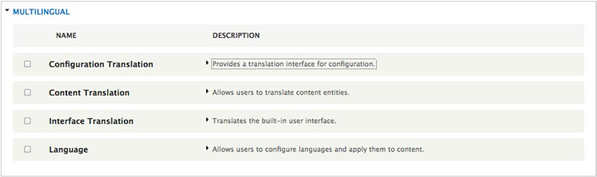

**图13-1 多语言模块列表**

配置翻译模块提供翻译网站中例如站点名称，词汇，菜单，区块等站点元素以及其他网站上和文本相关的配置功能。内容翻译模块提供处理所有和文本相关的事项，例如文章等。翻译接口模块为网页中的静态元素,提供多语言接口，比如表单的标签。 语言模块负责定义网站中所支持的语言。   核对多语言类别中所有的功能模块的配置，并点击保存配置按钮。 下一步是配置drupal 8的多语言功能。首先登录到配置页面。点击管理菜单的管理链接，在二级菜单中点击配置。在配置页面， 向下滑动页面，你将看到区域和语言部分（见图 13-2）

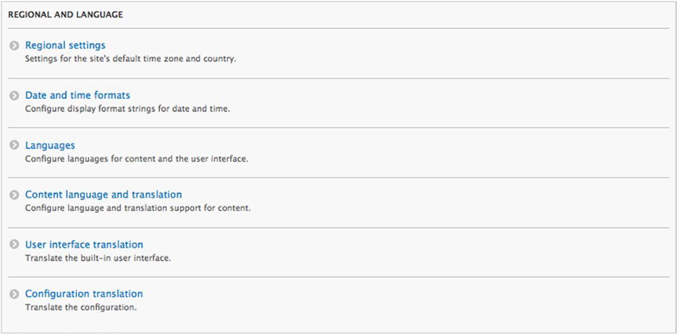

**图13-2 多语言配置选项**

## 指定网站支持的语言 ##

通过在配置页面的区域和语言部分，点击语言包的链接来设置你的网站所支持的语言。如果你在安装drupal 8 实例的时候将英语作为你的站点默认语言。你的语言包部分将显示如下图13-3所示的样子。

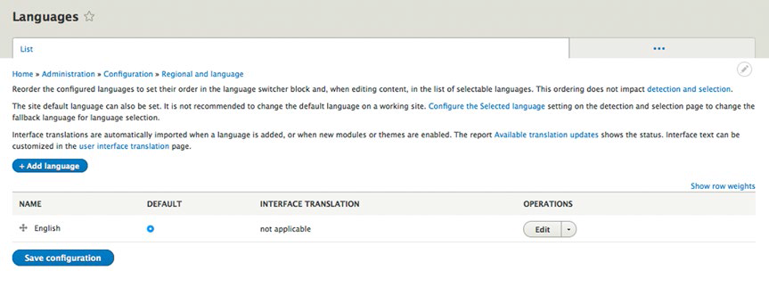

**图13-3 基础语言**

 要启用新的语言支持可以点击“添加语言”按钮，然后在你下拉菜单中选择一种你的网站将支持的语言，然后点击添加按钮，如图13-4所示。

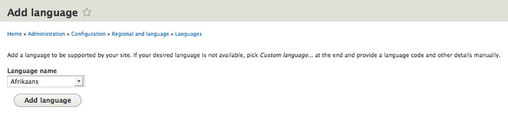

**图13-4 添加语言**

## 激活配置语言 ##

设定好你的网站所支持的语言列表之后，下一步是设定Drupal在什么情况下站点切换到哪种语言。在语言页的顶部，单击检测和选择的选项卡以 
查看列表中的选项来指定语言切换功能发生时的操作。（如图13-5）

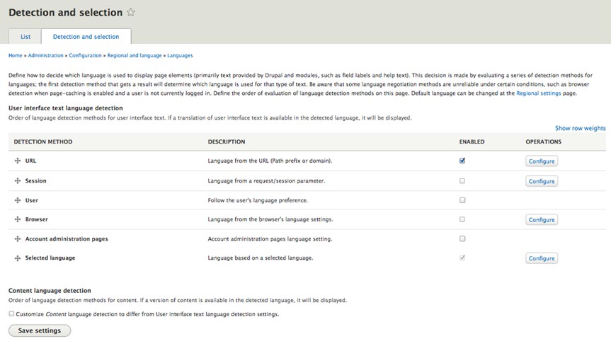

**图13-5 语言检测与选择**

  正如在检测方法一栏所示，你将有多种选择来指定Drupal如何决定选择哪种语言来呈现网页元素：

- 通过URL匹配的方式指定语言选择,例如：http://example.com/en为英文版本，http://example.com/ru俄语版本。

- 通过一个通过自定义代码设定并存储在缓存中的缓存参数指定。

- 通过用户浏览器首选项中设置的浏览器的默认语言。

-  帐户管理页允许您设置不同语言的管理接口和您的网站的内容部分。

- 用户从下拉列表或者一个选项中选择了一种语言，确保这种选择能够使块提供给访问者选择所想要语言的功能。

处于演示目的，核对查询的网址并选择语言选项，然后点击保存设置按钮继续。

+某些选项，如URL设置，提供配置定义这些设置将如何生效的参数的功能。点击配置按钮查看参数。 通过选择特定的语言选项，我们现在有机会获得这个为用户提供了选择他们喜欢的语言能力的区块。将这个区块放置到有“块状布局”的页面（管理➤结构➤块状布局），你将在块状布局的列表中看到一个名为语言切换的区块在系统类中。点击语言切换的链接，分配块到主题所支持的一个区域。如果您正在使用Bartik，一个不错的选择将是两个边栏的区域之一。您选择的区域后，不要忘记在“块状布局”页面的底部点击“保存块”按钮。启用“语言切换”块后，你的页面应该类似于图13-6。

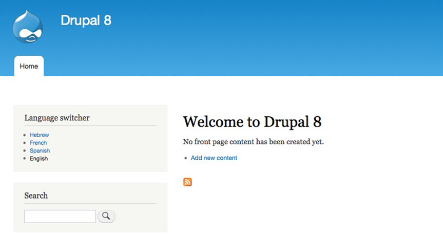

**图13-6 语言切换器区块**

## 内容翻译实例 ##

在添加完成“语言切换”区块之后，你现在可以准备做下一步内容翻译了。点击管理菜单中的管理链接，然后点击二级菜单中的配置链接退到配置页面。然后在配置页面点击语言包的超链接转到语言包页面。在确认完成你的网站所支持的语言之后，你会看到有一个名为接口翻译项（如13-7）的列。这一列展示了每一种语言已经翻译的元素数量（第一个数）和可以翻译的元素数量，可以翻译的元素是指标签，错误提示信息以及在模板文件或者模块中定义的字符串。如图13-7，很多元素已经已经由drupal社区翻译完成。

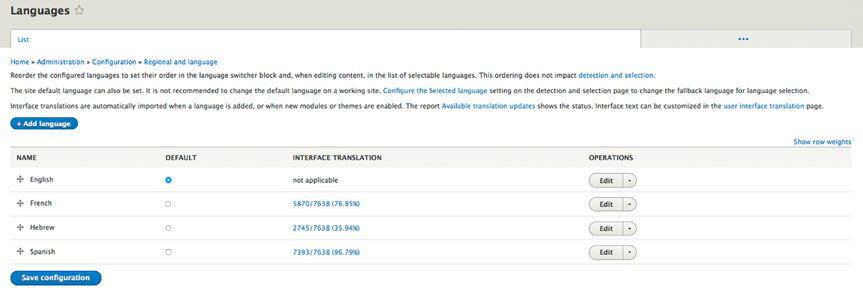

**图13-7 接口翻译**

   在需要手动输入翻译结果的文本框的界面翻译元素列表中点击任意元素(如图13-8)，如果需要过滤列表只显示没有翻译的元素，可以在过滤可翻译的字符串的查询功能部分点击搜索按钮，并选择只显示未翻译的字符串。点击过滤按钮将会显示未翻译的元素列表。

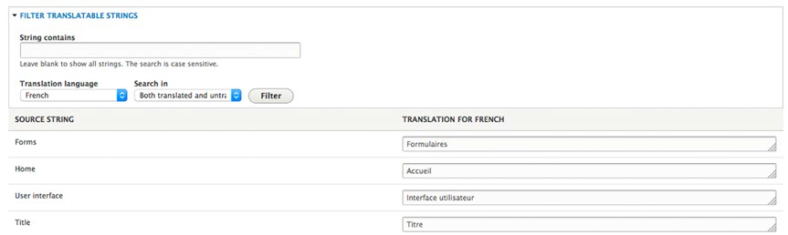

**图13-8 字符串翻译成另一种语言**

当输入部分或者全部未翻译字符串的翻译结果后点击保存翻译按钮。退回到语言包页面，你已经翻译的字符串元素的数量、字符串总数以及已经翻译元素的百分比都将显示在界面上。在你安装新的模块创建新的表单或者创建其他具有可翻译元素的功能时，需要翻译的元素总数可能会随之增加。因此需要经常查看该页面，确保相关需要翻译的元素全部被翻译。

##配置实体##

在安装了多语言支持网站的下一步是制定哪些内容类型，分类词汇和用户配置文件是可翻译的。返回到配置页面，在区域和语言部分，点击“内容的语言类型和翻译”链接（见图13-2）。在这个页面，你将会看到在你的网站上支持翻译类型的选项列表。只要选择你将为其提供翻译功能的元素即可。为了演示，选中内容，自定义菜单和分类术语三种。当你选中一项时，你将会看到一系列可以为该元素设置的翻译功能的选项（如图13-9）。

以文章内容类型显示的可被翻译的元素项明细为例。对于文章内容类型，包含标题，内容，评论设置，图片和标签。为了演示，选中所有项，并点击保存按钮。

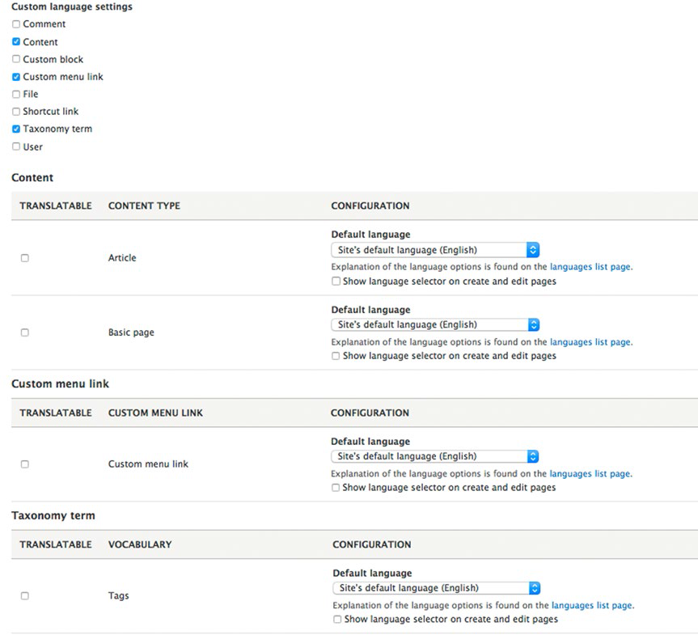

**图13-9 语言配置内容**

## 内容翻译 ##

一切就绪之后，接下来是将网站的本地语言翻译成你的网站配置所支持的各种语言。为了演示，假设你已经在上一步配置好了文章内容类型，用本地语言创建了一篇测试文章。点击管理菜单上的管理链接，在二级菜单中找到内容链接，点击“添加内容”按钮，选择文章的内容类型创建文章。需要注意的是在创建文章的表单中将会出现一个新的字段，也就是语言选择列表。为了演示，选择默认语言代表网站的基本语言（例如，如果您安装的Drupal8的英文版本，从选择列表中选择英文），例如，在我的Drupal8网站，我用“This is a test article”为标题和“Hello World this is a test article in English”为内容的文章。点击“保存并继续”之后，你将会在文章内容的表格上面看到一个翻译的选项（你需要以具有内容编辑权限的管理员身份登录）。这个新的标签允许你随时使用翻译功能。

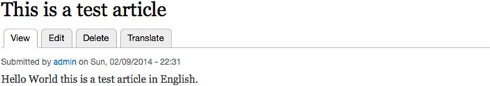

**图13-10 翻译选项**

单据翻译选项卡将显示的你在配置多语言支持列表中设置的语言并显示网站内容的翻译情况。（见图13-11）

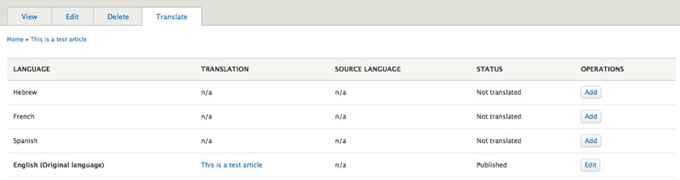

**图13-11 语言翻译状态**

单击特定语言的“添加”按钮将显示特定内容的节点编辑表单，允许您（或其他人翻译人员）看到该内容项的原始语言版本，并提供重写翻译版本的功能。列表中选择一个语言尝试该功能。这是将我的测试文章翻译成法语（参见图13-12）。 

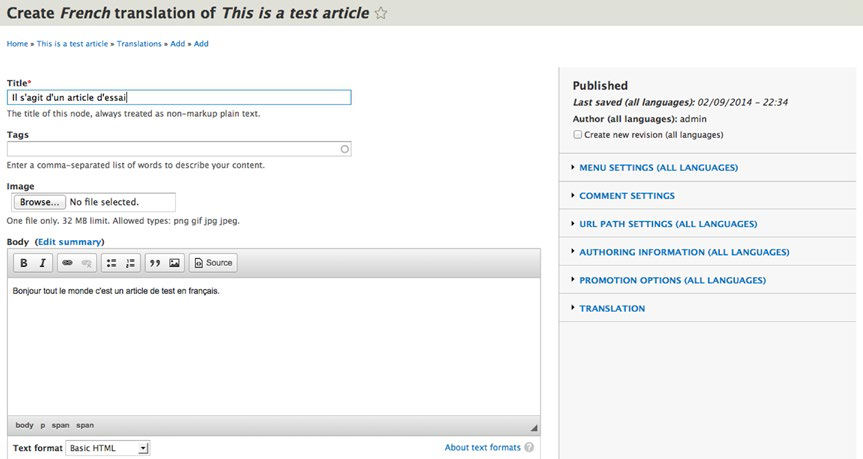

**图13-12 将文章翻译成法文**

点击保存并发布按钮之后，Drupal将显示你刚才翻译成的文章，并在语言切换模块高亮显示该语言。尝试按照前面的步骤，点击翻译选项按钮完成其他网址支持语言的翻译。在你完成所有的语言翻译之后，测试一下语言切换功能查看文章在每一种语言下的翻译情况。如果你选择了一种从左到右的语言（我选择了希伯来语），你会发现drupal 解析文章的细微不同：例如语言切换的区块等元素将会从左一到右边（假设你将语言切换功能放在在Bartik主题的边栏第一区块）。

如果你编辑了内容项或并更改了任何字段（例如，一篇文章的标题或正文），请记住，其他翻译需要随之更新。(见图13-10)

## 总结 ##

在这一章，我们讲述了drupal 8多语言支持的功能。这对于那些希望不仅仅能够吸引母语用户，还希望更广泛受众的网站是一个功能丰富而强大的工具。把你的网站内容翻译成多语言从而打开通过文字接触世界的机会的大门。而这正是drupal 8的一个强有力的功能特色。
