#第十四章 管理站点#

**翻译：蹊**

##管理您的 Drupal 站点

如果你遵循了之前的章节，你现在有足够的知识建立一个基于 Drupal8 的网站。建立你的网站并发布到世界上是一种让人惊喜的经验，总是给你带来巨大的自豪与快乐。无论你的网站有两三页或是几百页，部署一个网站，看着站上的访问量是一个有益和丰富的经验。部署你的网站只是旅程的一部分，它绝不是结束。作为一个自豪的网站拥有者，您必须监视它，培育它，展开它，支持它，所有这一切都囊括在网站管理中。

管理一个 Drupal 网站可以是一个相对简单的任务，这取决于你的网站的规模，用户的数量，有能力创作内容的用户数量，还有你已经安装的模块的数量。在过去的几年中，我创建了一些个人的、已经启动和运行的“pet”项目网站（译者注：由于个人兴趣搭建的项目网站），除了出去看一眼站点日志我没有做其他的。有一些我建的其他站点需要更多关注，而关注程度取决我刚提到的标准。
 
您需要考虑定期执行的典型的站点管理任务，包括

- 备份网站，这样就可以在发生灾难时恢复。
- 备份文件系统（目录文件）。
- 检查日志，看看是否需要你解决任何错误。
- 检查，看看是否有任何安全补丁模块已安装。
- 检查，看看是否有模块更新，部署在站点有意义。
- 检查，看看是否有 Drupal 核心 更新需要部署在站点上。
- 批准新的用户账户请求。
 
在本章中，我将详细介绍每一种管理任务。
 
##备份和恢复您的网站
 
如果你不想做这个管理任务列表上的事，至少要保证你的数据安全，遇到意外灾害可以恢复。你很容易推迟备份网站，因为你很可能几乎不需要回去从备份恢复的你的站点。但是，从经验来看，第一次你需要恢复你的网站、但你没有备份的时候，将会是你最后一次不从一开始就把备份准备好的时候。听取这个经验，花你几分钟设置备份很值得。

<!--但是，从经验来看，只要你曾经在需要恢复你的网站时候没有一个备份，你再也不会不从一开始就把备份准备好。-->

有三种路可以走，以解决您的新网站备份：

- 你可以使用你的服务器托管商给你提供的公共组件用来备份的数据库和目录等
- 你可以使用 Drupal 的 Backup and Migrate 模块，用定义的时间表自动备份站点的数据库，以及同样重要的是，很容易从以前的备份恢复您的网站。
- 你可以使用 Drush 下载网站和数据库的副本。
 
以上三种方法一样好，Backup and Migrate 模块是一个完美的解决方案，为那些不太倾向于使用操作系统级命令计划备份的用户创建脚本以备份Drupal站点。第一种方法缺点是覆盖太广，因为它的变化取决于您的托管服务提供商，所以我只阐述后两种方案。我将向您展示如何从备份恢复网站的方法。

##用 Backup and Restore 模块备份

Backup and Migrate 模块需要你去安装，因为它不是 Drupal 核心的一部分。你可以在 www.drupal.org/project/backup_migrate 找到模块细节。安装模块，遵循涵盖第11章的内容。

要访问 Backup and Migrate 配置页面，访问 http://localhost/admin/content/backup_migrate （使用您的网站所在的真实 URL 替换 http://localhost ）。按下回车键后，您将看到 Backup and Migrate 模块的配置面板。
 
配置 Backup and Migrate 模块的第一步是定义备份文件存储在服务器上的哪个地方。点击页面的顶部的 Destinations 选项卡，显示如图14-1所示的页面。文件存储位置由两个设置决定: 一个用于手动备份,在站点管理员处点击“现在备份”链接来执行备份，另一个就是自动备份。我将稍后介绍如何设置自动备份。你也可以设置你想要备份的数据库。默认情况下，模块自动检测你的站点使用的数据库并设置参数。在安装和设置模块的过程中，你可以选择覆盖默认的目录和数据库，或者你也可以像我一样，保留默认值。

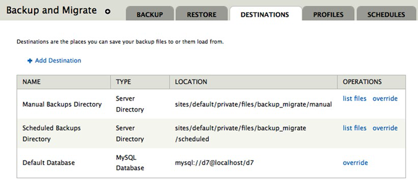

**图14-1.为备份设置目标目录**

下一步是设置自动备份的时间表。为此，单击页面顶部的 “Schedules” ，显示如图14-2所示的配置选项。如果你之前还没有设置计划，该页面会只显示 “Add schedule” 链接。单击链接可查看您可以设置的计划备份的参数。首先，输入计划的名称。我们将设置为以每天为基础进行备份，因此输入 “Daily Backups” 作为名称。接下来，设置 “Backup every” 字段为1天。最后，设置 “Number of Backup files to keep” 为14，这意味着 Drupal 将在删除最旧的备份和存储最新的备份之前，保留备份14天。这有助于保护您免受旧备份文件消耗大量硬盘空间。精心设置这个值。你可以依你的行业的法定要求，保存文件在某些天，周，月，或者年。最后，点击 “Save schedule” 按钮。

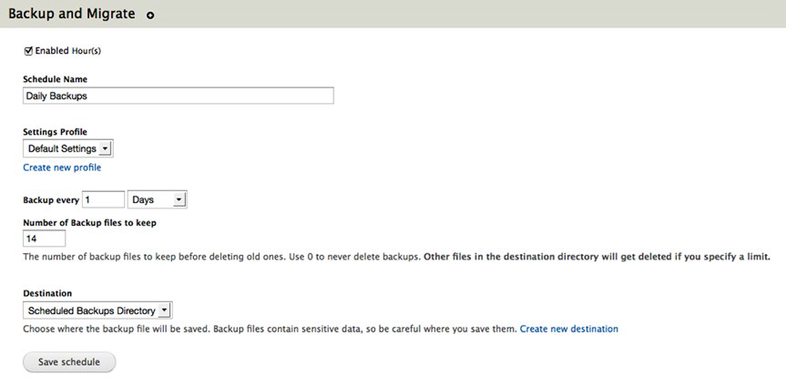

**图14-2.设置自动备份的时间表**

Drupal 现在可以自动以日期为基础备份站点了。最后一步是执行你的站点的手动备份。这样做，点击Backup标签（看图14-3）。在结果页面上， Backup from 后面的列表设置为 Default Database  ，选择默认数据库（ Default Database ）作为备份来源（ Backup from ），将“到（ to ）”设置为手动备份目录（ Manual Backup Directory ）（你可以选择下载到本地电脑），将“使用（ using ）”设置为默认设置（ Default Settings ）。最后点击 “Backup now” 按钮

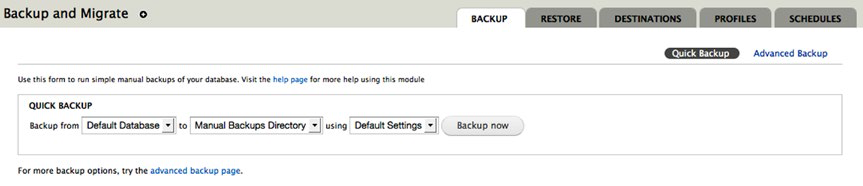

**图14-3. 手动备份你的站点**

备份完成时，Drupal 会在屏幕上重新显示生成的备份文件的名字，存储目录，备份花费多长时间执行。

##用Drush备份

对于那些熟悉命令行的站长，使用 Drush 命令行提供了一个简单的解决方案。备份数据库，如果只是备份数据库，只要定位到你的站点的目录结构内，从命令提示符执行以下 Drush 命令，使用你希望的文件的名称替换<filename>:

```bash 
drush sql-dump –-result-file=<filename>
```
 
这运行的结果是一个SQL转储被创建并存储在 Drupal 站点的根目录。如果你想备份整个网站，包括代码、文件、数据库、使用`drush archive-dump`, 这个命令会创建一个归档文件，其中包含3个文件。使用 archive-dump 时， Drush 创建一个以日期和时间为文件名的归档文件，并在完成的时候报告文件的存储位置。

##恢复备份
 
如果由于某种原因，你需要恢复之前你备份的系统状态，你可以使用和你创建备份相同的工具恢复备份，如下所述。

##用 Backup and Migrate 恢复

如果你需要用备份和迁移这个模块创建的备份恢复系统，请返回到 Backup and Migrate 管理页面（http://localhost/admin/content/backup_migrate），并选择备份文件恢复系统。单击 Destinations 选项卡，显示存储备份的目标目录列表。参见图14-4。 

 

**图14-4. 存储备份的目标目录列表**

因为我们使用手动备份，点击 “list files” 链接手动备份目录，显示如图14-5所示的页面。

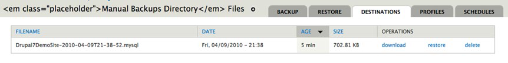

**图14-5. 手动备份目录和文件来恢复**

在这个例子中，我们能够只需在备份文件点一下恢复，从我们某一时刻某一状态的手工备份恢复系统。如果你启用定期备份并没有手动备份你的系统，描述的过程是相同的，除了选择的 “list files” 链接来自定期备份目录，点击该链接会显示备份文件，这些文件是基于此前几步由你设置的定期备份而自动创建的

##用 Drush 恢复

对于那些熟悉命令行的人，使用 Drush 命令行提供了一个简单的解决方案。从 `drush sql-dump` 创建的备份恢复数据库，只需在定位到你的站点目录结构内，在命令提示符执行下列 drush 命令（将 example.sql 替换为你用 sql-dump 命令时创建的文件名）

```bash
drush sql-connect < example.sql
```

从 “archive-dump” 文件恢复整个网站，使用
`drush archive-restore <filename>`，`<filename>`是归档文件的名称，文件中包含了代码，数据库，和文件。

##备份文件系统

Backup and Migrate 模块只备份你的 Drupal 数据库的内容。Drupal设置本身，意味着 Drupal 核心，你安装的贡献模块，安装的主题，对模块的定制，用户上传的任何文件，都不会被 Backup and Migrate 模块保存。

备份文件系统有几个选择：

- 简单地将整个 Drupal 目录复制到另一个地方（例如，下载网站到本地计算机，如果您在托管服务器上运行）。
- 复制的Drupal目录到 USB / CD / DVD ，如果你在你的本地桌面/笔记本电脑上运行。
- 在托管环境的情况下，与供应商合作，以确保您备份 Drupal 目录的频率足以保证在发生灾难的情况下，损失降到最低。
- 使用命令行创建网站的归档文件（如 tar 文件）。

无论您选择哪种方案，如果用户上传文件和发布的内容带附件（甚至每天备份，就像你在Backup and Migrate 设置的计划），您应该频繁备份文件系统，如果你禁止上传文件和内容附件，最好还是每周备份（由于模块更新）。

##恢复文件系统

要恢复文件系统，复制你在前几部创建的备份，拷到你的站点的服务器的根目录下，如果您使用的压缩工具，例如 tar 或 zip ，在根目录下解压。

##检查日志文件

有了备份，下一个管理任务是，定期检查日志文件，以查看是否有在系统中需要被纠正的错误（例如，“page not found”错误）。要查看日志文件，单击顶部菜单的报告（ Reports ）链接，显示报告列表，它们可帮助您管理您的新 Drupal 站点。见图14-6。
 
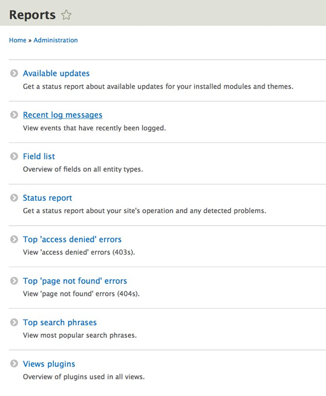

**图14-6. 标准报告列表**

我将在本节聚焦其中三份报告（你只要点击链接就能轻松查看其他报告）: 最近的日志消息，“page not found”的错误，状态报告。 （我将在本章后介绍可用更新。）
 
##最近的日志消息
 
Drupal 提供了丰富的事件记录框架，对于管理 Drupal 站的人可能会对此感兴趣。模块开发人员和 Drupal 核心维护人员利用此功能来记录任何的，他们觉得很重要的，足以记录在日志文件的事件。如果单击“最近的日志信息”链接，你会看到一个报告，类似于图14-7。

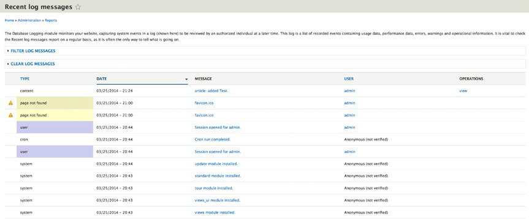

**图14-7. 最近的日志消息**

您的邮件将在图14-7所示的不同，因为你已经执行的操作会有所不同。消息的该列表包括错误和成功的事件（例如，用户登录到系统在日志文件中的结果，显示他们登录的日期和时间）。只需点击该邮件，就能看到 Drupal 核心 开发者认为有必要分享给站点管理员的细节。解决你可能会看到错误的最好的资源是去 Drupal.org 查看出错的模块的相关讨论。如果你没有在模块的相关页面找到答案，第二步就是去 Drupal.org 的论坛发帖询问，这种情况极少，除非你是遇到错误的第一个人，如果真是这样，在论坛上发帖求助的话，通常获得知道如何解决这一问题的人的快速响应。

##顶部“找不到网页”的错误

返回到报告主页，并点击“Top ‘page not found’ errors”链接，显
示“404”错误和或者“page not found”错误的列表。见图14-8。

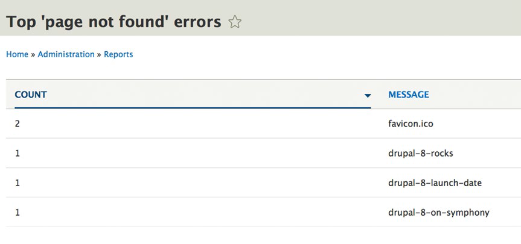

**图14-8.“page not found”的报告**

重要的是定期检查这些报告，看看是否有访客点击链接时出现“坏链”。解决页面上的错误列表需要对你的部分进行调查和分析。你应该聚焦计数高的错误，因为这些错误可能会影响到访客。要解决“page not found”错误 ，你有三个基本选项：忽略这些错误，为报错“page not found”的 URL 创建对应的页面，或在 .htaccess 文件中创建重定向规则，将这些请求重定向到一个有效的URL。

##状况报告

一般来说您的网站的“健康”报告可以从报告页面点击状态报告 （Status report） 链接进行访问。单击这个链接显示一个页面，这个页面高亮显示了 Drupal 中相对重要的设置（见图14-9）。当你运行这个报告，项目会被检查，包括是否关键配置文件是否免于未经授权的修改，是否更新数据库。 Drupal 8 的模块安装有修订办法，所以数据库不可能过时。如果出现数据库被报告为过时，运行http://localhost/core/update.php脚本，数据库与模块的当前状态同步（通过您的站点所在的实际URL替换http://localhost ）。

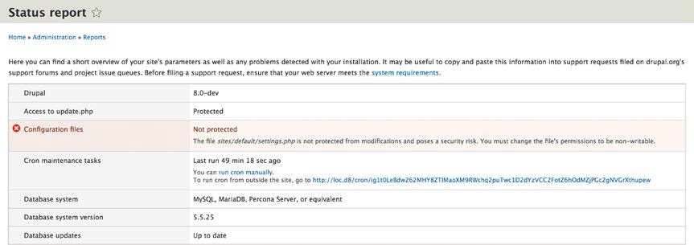

**图14-9. 状况报告**

你最有可能去看 Drupal core 的状态，贡献模块和主题的问题。如果 Dupal.org 有Drupal的新版本，或者贡献模块，主题有了新版本，这些项目将显示为黄色。

##检查更新和安全补丁

如果状态报告显示模块或主题有更新可用，你需要检查，看看哪些类型的更新可用。无论是在你开发新网站的时候还是网站已经成品的时候，还有这有三大类更新目录需要你重视：

- 安全补丁
- 模块更新
- Drupal 核心更新

在大多数情况下你会想尽快解决安全更新，而你可以选择每月，每季甚至更低频率的更新模块和 Drupal 核心 。模块和 Drupal 核心 的更新的典型处理是，发现模块或者 Drupal 核心 的bug并且/或者提供新特性给模块或 Drupal 核心 。作为站点管理员，你将需要确定，通过查看每个更新的版本说明，决定是否马上更新（例如，修复一个在站点上折腾的bug），或者延迟修复。

检查是否有任何安全补丁或更新，单击模块和主题项目旁边的状态链接报告上的 out of date 链接。 out of date 报告列出你安装在站点上有更新的模块和主题。是你决定下载并安装模块更新之前，在 Drupal.org 访问每个有更新的模块的主页，看看有没有人报告模块的新版本有bug，这是个不错的主意。我曾经经历过一个案例，我的一个站安装了新版的模块，引起了网站升级前所没有的的bug。升级前检查一下是个好习惯。 

要安装一个主题或模块的更新，只需点击“下载更新”。Drupal 将自动下载，安装并启用了更新。见图14-10

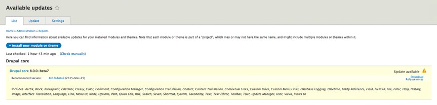

**图14-10. 可用的模块和主题更新**

在 Drupal 核心被更新的情况下，这个过程是稍微复杂一些。要更新 Drupal 核心：

1. 确保你已经备份数据库！
2. 确保备份整个 Drupal 的目录！
3. 使用 Drush ，运行以下命令：`drush up drupal`
4. 测试您的网站。
 
更新 Drupal 核心的另一种方法是，先备份 modules，profile，sites 和 theme 目录和 .htaccess、web.config 文件在您的网站的根目录下，一旦确保拷贝这些目录，下载 Drupal 核心，并提取存档文件到您的网站的根目录。提取过程是：把Drupal放在一个你下载的带版本名字的子目录里（例如，Drupal-8.0.0-beta7），把子目录里的文件都移动到网站根目录。如果在 Linux/OS X，使用以下命令:

```bash
mv * ../
```

```bash
mv .* ../
```

如果是在其他的操作系统上，使用能用的工具，移动文件和目录。

一旦你移动 Drupal 到位，继续移动备份文件和目录，移动到站点根目录下各自的位置。
 
##审批用户帐户的请求
 
Drupal 让你，一个站点管理员，确定如何在您的网站创建用户账户。您可以
 
- 允许站点访问者创建自己的账户并且不需要站点管理员批准。
- 允许站点访问者创建一个账户，但是需要站点管理员批准后才能使用这个账户。
- 限制为只有站点管理员可以创建账户。
 
选哪种方法，完全取决于你是否允许游客有自己的帐户。如果你的网站上不提供这种互动功能，就没有理由让游客创建自己的账户。如果你给认证用户提供有限的权限（例如，如果你不让通用“认证账户”有任何管理权限功能）同时你不想被求账号的打搅，那么最好让访客未经批准就可以创建帐户。如果你想控制谁可以拥有账户，那么你将要配置您的网站，访问者可以注册一个帐户，访客可以注册账户，但是在他们的账户激活前需要你通过他们的请求。
 
要设置您的网站如何处理用户帐户，单击顶部菜单的“配置”链接，展开你的站点的主配置页面。在这个页面，你会看到一个选项类别 “PEOPLE” 。在这一类别中，你会看到一个“账户设置”链接。点击链接，显示帐户设置页面，如图4-11所示。
 
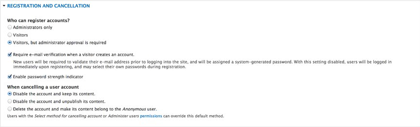 

**图14-11. 账户设置页面**

在这个页面，你会发现一个区块标题叫 Registration and  Cancellation。在图14-11中，选项设置成游客在这里可以注册一个用户帐户，但需要管理员的批准。

要查看此功能的工作原理，请点击页面右上角的角落的“退出”，这将以匿名用户身份返回您的站点的主页（没有登录到该网站）

在左列中，登录表单下，有一个链接“创建新帐号”。单击链接看到一个新的用户可以申请一个新的帐户的表单。

游客需要提供用户名和一个有效的电子邮件地址创建一个新帐户。一旦这些参数被输入且访问者点击“创建新帐号” ，Drupal重新在你的站点主页提示消息，他们的账号正在等待站点管理员审核。

您作为网站管理员，现在必须激活他们的帐户。要做到这一点，点击页面顶部的 People 链接查看你的站点上的用户列表。见图 14-12

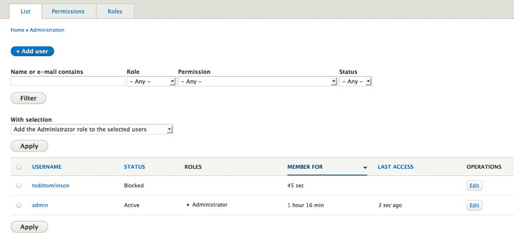 

**图14-12. 新用户列为阻止**

在图14-12中，可以看到一个名叫 托德•汤姆林森 的账户刚刚创建，而且用户的状态被设置为阻止，这意味着用户被阻止登录到网站。
如果你的网站有几个用户帐户，您可能需要过滤列表,只看被阻止用户和需要激活用户。为了过滤列表，单击字段状态选择列表下方的 filter 按钮，选择 blocked。

下一步，点击 filter 按钮，限制只有那些被阻止和需要被激活的用户的列表显示在页面。点击每个您要激活的用户旁边的复选框，并确保更新选项选择列表设置为 解除被选择用户的阻止 点击 update 按钮。
一旦更新完成了, 状态栏现在显示我们的新用户 托德•汤姆林森 是激活状态。见图14-13。

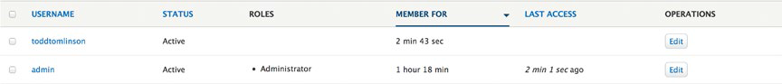 

**图14-13. 所有用户设置为激活**

##小结

在这一章中，我介绍 Drupal 网站的基础管理。我解释了与运行您的新网站相关的关键的管理任务。

依赖于你的站点的复杂性和你部署的特性，这里可能会有另一个针对这些附加功能的管理任务。这个列表会获取你开始的路径，以确保你的网站是有备份，无错误，最新的。欲知其他的 Drupal 管理话题, 访问 Drupal.org 网站。

哇，在这点我们已经介绍了大量的信息。现在，你有建立从简单到复杂的网站的必要知识，你现在知道如何管理你的新网站。下一章概述 drush 工具。

