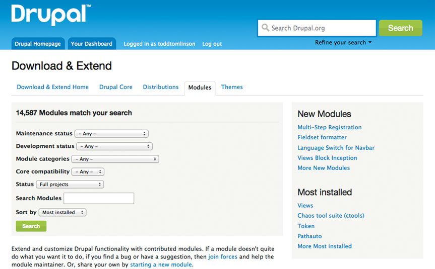

# 全部放在一起

**翻译：蓝眼泪**

读这本书为你继续提升Drupal技能打下很好的基础。如果你刚接触网页内容管理系统的概念，那么当你第一次使用Drupal建站的时候你很可能没办法立即进入状态并建立一个高度复杂的网站。但是，就像生命中所有的事情，你必须从某一个地方开始，并且你现在有工具和知识可以开启你的Drupal之旅了。对于那些曾有过内容管理经验的人，希望这本书在指明 Drupal 如何工作上有所帮助，这样你就可以将你在其他CMS平台上知道的东西和 Drupal 提供的东西相关联。

##现在做什么

学习任何东西都需要练习，练习带来舒适感，这种舒适感又带给我们做新事情的能力与动力。学习 Drupal 需要时间，学习，实践，和耐心。学习 Drupal 做好的方法之一就是用 Drupal 建立一个真实的网站。不论这个网站是关于你孩子的体育团队、你的教会、一个社区、非营利性组织，或是其他阳光下的事物，专注于一个有利于一些人或组织的项目可以让你有学习动力，这动力在你学习的过程中会有所帮助。你又如何能一直跟得上Drupal的最新知识进度呢？

##看一下其他基于 Drupal 的网站的思路

虽然你很难在看到一个网站的时候就知道那是一个 Drupal 站，不过这有一个很好的资源帮助你找到用 Drupal 创建的网站。 Drupal 的创始人 Dries Buytaert 建立了一个清单，清单上都是用 Drupal 创建的知名度很高的网站。你可以在他的个人网站上找到这个列表，链接：http://buytaert.net/tag/drupal-sites。Dries 在搜罗来自世界各地不同行业和地点的广泛的网站这方面做得很好。他在不断地更新这个列表，所以为那个网页加一个书签并经常访问是一个很好的主意。

通过浏览 Dries 收集的网站列表（目前已超过100）你可以很快地察觉到人们成功基于 Drupal 建立的网站的类型。通过浏览其他网站你可以获得一些灵感，这个灵感包括设计（网站的视觉效果）、布局（页面如何结构化）、组织结构（内容的显示方式）以及已部署的特性和功能。查看其它网站是许多开始做 Drupal 新项目的一个共同的起点。

##密切关注 Drupal 和贡献模块

使用 Drupal 的好处之一就是它是一个不断发展的平台。当网络上出现一些新概念，Drupal 往往是第一个具备相关实现能力的内容管理系统，要跟上这种变化很简单：经常看看www.drupal.org/project/project_module，看看最新的模块和网站上发布的更新（如图17-1）

**图17-1 Drupal.org上查找模块搜索的过滤器**

当访问页面时，你会看到“排序”（ Sort by ）选择列表，其中一个选项是“最后发布”（ Last release ），选择这个选项，点击搜索，模块列表会以日期降序排列，最新的模块将在列表顶部。根据你访问网站的次数，你可能只需要几分钟浏览一下新模块的列表，看看有什么是可用的。

##获取参与本地 Drupal 用户群

在全球有数以百计的 Drupal 用户群，包括区域性的用户组以及针对一些特定主题或行业（如教育、图书馆、政府等）的用户组。你本地的 Drupal 群是一个认识你的社区内的新的 Drupal 用户的好地方，也是一个学习的好地方，因为大多数的群组在定期举行的见面会中会提供一些培训。通过访问 https://groups.drupal.org 定位一个你附近的群，或者是针对你感兴趣的领域的群。

##在 Drupal 上建立你的网站的方法

虽然在 Drupal 上建立网站没有正式的“ Drupal 方法论”，但是有几个行业最佳的实践和流程，你可以以此为参考开始建立你的 Drupal 网站。表17-1描述的流程看起来有些太大，而且比你认为你建站所需要的复杂得多，但是从以往的经验中我发现，基于我建立网站的范围和复杂性，考虑列表中的步骤应用并执行它是很适当的方式。

**表17-1 在 Drupal上 建立你的网站的方法**

| 阶段 | 任务 | 具体内容 |
| :-- | :-- | :-- |
| 1   |     | **开始你的项目**  这个阶段有七个任务用来帮你思考并定义你的网站将做什么。Drupal 就像一堆木材：使用适当大小的木材你可以搭建出任何类型和风格的房子。然而，在你想好要建的房子的细节之前你不会先拿着板子和钉子直接做。你可以把项目的这个阶段当制作你建站的蓝图。在这个阶段，你要在纸上记录网站的关键环节，而非在 Drupal 上。当你了解了你要建什么就可以开始你的创建活动了。  |
|     | A   | **你的新网站是关于什么的？** 以叙事的形式记录一下，你新网站的目的是什么，通常还要描述一下网站的目标客户。把这个文件作为你的“电梯演讲”，意思是，如果你在电梯遇到一个人，他问你你的网站是做什么的，你可以在离开前逐句背诵这个文件内容来回答。这个活动会迫使你用简明的术语定义你的网站是什么，访问网站的会是哪些人。 |
|     | B   | **确定谁将访问和使用你的网站** 列出你新网站的目标访客的各种类型，例如一个图书馆的访客类型可能有儿童、青少年、年轻人、成年人、求职者和老年人。最受欢迎的一个方式是找一张白纸，在纸上画一个盒子，将这个盒子当做浏览器窗口，窗口里面是你的网站，在盒子上画一些“火柴人”，并为每个“火柴人”添加一个类型标签。 |
|     | C   | **确定你将向访客提供的内容** 在搭建网站的过程中，常常有人雄心壮志地想“如果我撘起来了，他们就会来访问”，这是一个错误的想法。 那即使他们访问你的网站，你将向他们展示什么内容让他们可以留在你的网站上，在网站上四处浏览然后将你的网站添加到标签夹以备日后访问。你可能希望为每一种类型的访客画一张纸，在左边画一个人物并列出这个人在访问网站时会感兴趣的内容。不同访客类型之间的内容可能会有重复，这没关系，最重要的是你要为每种类型的访客量身定制，想想要向每一位访客提供什么内容使他们注意并不断访问我们网站。对于一个图书馆网站，内容类型可能就是书评、影评、音乐评论、推荐阅读书目以及在图书馆将要上新的目录。 |
|     | D   | **确定你将向访问者提供的功能** 内容通常只是构成网站的一个方面，你可能想要提供一些交互性的功能，如博客、调查、视频、音频、论坛、在线表单、电子商务、RSS订阅，或其它交互功能。在这项任务中，列出你想向访客提供的所有交互性功能。 |
|     | E   | **定义网站结构** 检查前几步中记录的内容类型和功能，你将开始看到逻辑分组和类别。您可能会看到基于一个话题或科目的逻辑分组，或者你会看到基于特定类型访客的分组。我们用图书馆网站作为一个例子，你可能在书评中看到横跨所有访问者类型的逻辑分组，你也可能看到专注于老年人和他们的社区资源的使用的内容的逻辑分组，这里的每个逻辑分组都可能，也许应该，成为你网站的一个主要页面。 |
|     | F   | **定义内容类型和分类结构** 可能有些内容类型并不像 Drupal 的页面内容类型那样只需要一个标题和正文。例如，你定义“事件”作为一个内容类型，一个事件需要有标题、开始日期、开始时间、结束日期、结束时间和地点，而为“事件”创建一个自定义的内容类型应该是比较好的，该内容类型会强制要求那些附加信息的输入，而不是依靠作者自主地在普通页面输入那些值。在这一步中，你要创建自定义内容类型的列表并为每一个内容类型添加相关的属性（如开始日期、开始时间）。在定义内容类型的时候，也该考虑一下分类以及如何在网站上归类内容了。  |
|     | G   | **定义网站导航结构** 你对以下内容都有了理解，访问者类型、他们想在你网站上看到什么内容、你网站的逻辑分组和主要页面组成，现在可以定义网站的导航（菜单）了。如果你知道某个特定访问者类型是你的主要访客，那么应该提供一种方式让他们可以很容易的找到想看的信息，要实现这个最典型的做法是提供一个菜单。在这个任务中，你将确定所有你希望为访客提供的链接，并且确定这些链接将如何组合起来（如菜单）。以图书馆为例，你可能决定在页面顶部创建一个主菜单，这个菜单会提供图书馆、地点、时间以及如何联系图书馆的链接；你可能决定创建二级菜单，将访问者通过链接引导至图书、电影、音乐或活动的页面；你也可能决定创建另一种菜单，它有助于引导特定类型的访客直接到他们感兴趣的领域的页面，如青少年，青少年，成年人，老年人，和企业主的链接。您可以通过定义某些菜单链接的下拉菜单项来将这个概念引导到另一个更具体的层次上；例如在书籍这个菜单下，你可能想提供一些链接如：推荐的书籍、新书、可订购书籍。 |
| 2   |     | **设置你的Drupal环境** 	现在，你对你要建立的东西已经有所了解，下一阶段就是配置 Drupal 环境以开始创建我们的 Drupal 网站 |
|     | A   | **确定将你的新网站部署在哪里** 您可以轻松地在您的桌面或笔记本电脑上建立新的网站，然后在托管的环境上部署该网站，或者你可以选择在有你网站生产版本的环境下建立网站，两种方法都很好。然而，在不久的将来你会想要将网站部署在有商业可行性的托管供应商那里，或者是你自己组织的托管平台上。要查找支持 Drupal 的商业托管服务提供商的清单，请访问www.drupal.org/hosting。 |
|     | B   | **安装和配置Drupal** 根据附录 A 中一步一步的介绍，在台式机、笔记本、或托管服务提供商提供的环境上安装 Drupal 。
| 3   |     | **视觉设计** 你可以在网站创建的前期，中期或者结束前，选择或设计 Drupal 主题。对大多数人来说，大致了解网站做出来的样子，有助于想象网站最终的布局。可能会有一种情况，你无法提前选择或设计主题，比如你要为一个品牌（包括logo，颜色，图案，字体，等等）尚未完成的组织建立网站，在这种情况下，我们仍然可以使用一个通用的主题继续创建网站。 |
|     | A   | **寻找一个符合你要求的现存主题** Drupal.org 上有成百上千的主题，可能有的主题的布局和设计刚好与你想要在网站上使用的方式很接近。访问 www.drupal.org/project/project_theme 查看主题列表。如果你找不到符合需求的主题，你可以使用 Drupal 网站上列出的“启动器”主题之一（如禅-Zen）作为一个开始。重温第六章看一下如何下载和安装 Drupal 主题的详细说明。 |
|     | B   | **实现您网站的特定设计元素** 如果你从 Drupal.org 选择了一个现成的主题（而不是从零开始创建的），你可能会想要改变主题的 logo 、颜色等内容。主题开发这个话题已经超出了这本书的范围，不过你可以阅读后边的 Drupal 主题的概念，你会在 www.drupal.org/documentation/theme 页面发现你想查看的文件，通过修改文件以实现自定义主题。 |
| 4   |     | **下载并安装贡献模块** 在第一阶段的任务 D 中，你记录了想要向访客提供的除内容外的功能（如博客、RSS、视频、投票、论坛、电子商务等），在这个阶段中你将搜索、安装和启用所需的可解决需求功能的模块。 |
|     | A   | **确定需要的来解决所需功能的模块** 有些功能可能能通过 Drupal8 的核心模块来实现（如 Book 、 forum 等），而其他功能可能需要查找合适的模块来实现。访问 www.drupal.org/project/project_module 页面来查找模块。使用页面顶部的过滤器根据你想要在网站上实现的功能缩小这些模块的搜索范围。如果你正在苦苦寻找合适的模块，是 Drupal.org 论坛是一个很好的资源。社区是非常有用的，在上边发布一个关于用什么模块来实现特定的特性或功能的简短的问题，可能会减少你研究的时间，并且避免选择不适合的模块。 |
|     | B   | **下载和安装所需模块** 当你确定了可以实现你网站上功能的模块后，按照第十一章的步骤对每一个模块进行安装、启用、配置并设置权限的操作。 |
| 5   |     | **创建自定义内容类型** 如果你在第一阶段的 E 任务处确定了要创建的自定义内容类型，那么现在是时候创建自定义内容类型了。按照第5章的说明，使用内容类型列表和各自的属性列表来创建新的内容类型。 |
| 6   |     | **创建视图** 在某些页面上，你可能需要提供一个内容的列表或表格视图。现在是一个构建这些视图来支持下一步中创建的页面的好时机。如何创建视图，请查看第9章。 |
| 7   |     | **创建一个普通页面** 使用书中描述的技巧来创建实际的页面（例如，使用布局模块来创建复杂的页面布局）。查看10章描述的如何使用布局，和8章使用区块的描述。创建您在第一阶段，任务E中确定的各个页面。 |
| 8   |     | **完成网站上的菜单** 随着页面的完成，现在要准备好完成网站的菜单。重新查看第一阶段任务F中定义的导航结构，确定已经解决了网站上的所有导航需求。如何创建菜单，请查看第7章。|
| 9   |     | **完成配置** 进行到这一步，应该要配置网站了。在这一阶段，确定你已创建了所有用户角色，已经赋予了不同角色相应的权限，并配置了如何创建用户账户。如何定义角色及分配权限，请查看第3章。 |
| 10  |     | **创建内容** 现在你已经配置了网站，创建了内容类型，定义了视图，创建了面板，定义了用户角色及权限，现在应该在网站上创建内容了。 |
| 11  |     | **测试网站** 当你的网站准备进入生产环境的时候，要先进行测试，以确保你你预期的每一项都能实现。作为一个匿名用户（未登录到网站）进行网站的测试。为每一个你定义的角色创建一个账户是很好的方法，以每一种角色登录，确保每一个角色的权限都和预期的一样。 |
| 12  |     | **部署到生产环境** 现在将网站部署到托管的生产环境下。 |
|     | A   | 如果你是在你的电脑或笔记本上创建的网站，那么需要把整个网站的目录复制到托管的生产服务器上，还需要备份数据库并在托管环境下恢复数据库的数据。有关此过程的其他详细信息，请查看第14章。 |
|     | B   | 如果您是在托管服务提供商平台创建你的网站，那么你就不需要移动您的网站了。 |
| 13  |     | **管理您的网站** 像在第14章中描述的那样，监控和管理新的 Drupal 网站。 |

##总结

在这一章，我讲了创建 Drupal 新站的方法，这个方法将我在书中涵盖的步骤都联系了起来。虽然每一个网站都是不同的，但这些步骤大致适用于任何类型的网站。将这套方法中的每一步都想一遍，这很重要的，事实上，我会建议你找一个安静的角落，把这个方法大略的走一遍，然后再开始创建你的新网站。这套方法迫使你在开始建站之前要思考你想要达到的目的是什么，最大限度的减少建站的风险，然后你会发现你几乎完全避免了那些风险。

下一章的重点是创建响应式的网站，意思是使你的网站良好地显示在各式各样的设备上，如智能手机、平板电脑、笔记本电脑、台式机、或其他的像手表一样的新兴设备等。