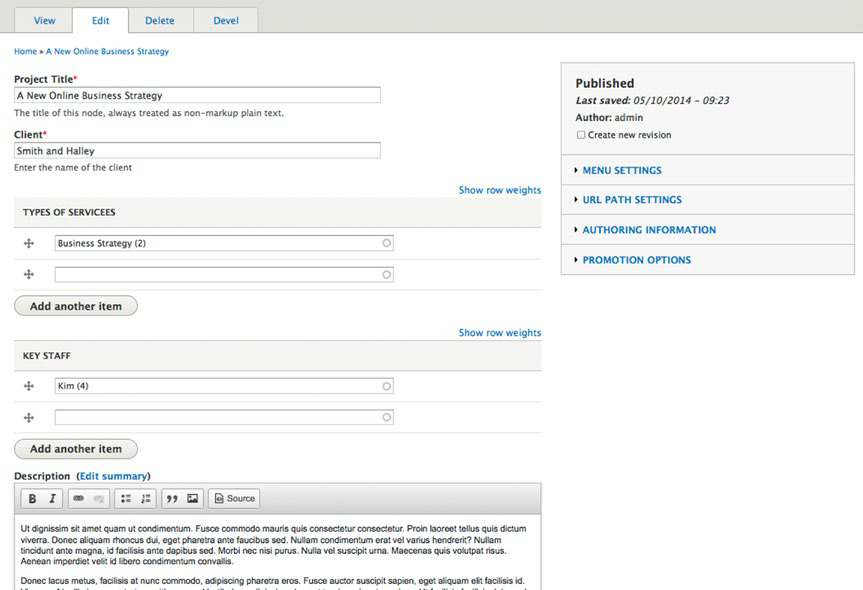

#第二十章:创建一个企业网站#

**翻译：Lead**

#创建一个企业网站

在一个相对较短的时间里，互联网改变了商务相关的一切。曾经的在互联网上拥有一个网站是个新事物，现在拥有一个网站成立无论大公司还是小公司都不不可少的内容，部分行业。在客户的眼里，一个没有企业网站的公司经常被认为是不合法的公司。很幸运，Drupal 8 是个十分优秀的快速和高效的创建在线网站的一个很好的平台。
在本章中，我们将建立在这本书中涵盖的概念，重点建设一个以市场为中心的网站，是一个适用各种公司的功能性网站。为证明用Drupal建立公司网站的方便性，我将创建一个以营销为重点的网站为公司提供一般业务咨询服务的公司。
我将假设你在和我学习建设一个网站作为练习，当然也欢迎使用这个案例作为指导去创建你自己的网站。

### 确定一个企业网站的需求
正如在本书中几次提到的，在创建任何网站的开始都是确定站点的需求。
我们的示例公司网站的需求在如下：

1.一个总体的关于我们的页面样式

2.一个客户项目的组合

3.一个总体的公司提供的服务内容和从每个客户案例信息链接到对应的服务项目。

4.一个突出主要成员的高亮显示部分

5.作者和发布新闻文章的功能。

6.从不同的源推送和基本业务相关的新闻。

7.指定的成员发布博客的功能。

8.一个联系表单。

9.一个主要的导航菜单，连接到网站的主要部分。

10.在页脚列出关键页的脚注，该公司地址和联系信息。

11.一个企业主题样式。

手上有了以上的要求后，我们就可以明确如何用Drupal实现这些需求。 对应的要求列出的解决方案如下：

1.使用基本页面内容类型去创建一个描述公司的页面。

2.使用一个自定义的内容类型来定义客户项目案例。

3.使用文章类型来标记提供的服务内容，以及一个实体引用字段链接选定的客户项目。

4.扩大Drupal标准的用户配置文件去包括员工的个人信息，并添加一个视图显示一页作为员工简介。

5.创建一个名为文章类别的分类词汇表，添加词汇表项(例如，新闻，博客，提供的服务)，添加一个视图来显示新闻文章按时间顺序排列(按时间降序排列，在列表顶部显示最新的文章)。

6.使用聚合器模块将网络上的新闻源显示在网站上。

7.使用文章内容类型创建博客文章类型分类及术语。我们还将添加一个视图来显示博客文章按时间顺序排列（以最新的博客文章在列表顶部的最新博客）来显示博客文章。

8.使用联系模块和由其提供的联系表单

9.使用区块和菜单。

10.使用drupal.org提供的一个主题。

### 安装Drupal

在明确了网站的需求及如何实现这些需求后，在创建网站的接下来的一步是安装Drupal。按照概述附录A安装的步骤可在本地的步骤，或在您的服务器上，或共享主机，或Pantheon及Acquia这样的解决方案。

### 安装和创建一个主题

在安装Drupal之后，接下来的一步是选择一个主题。你有很多选择：

• 从零开始创建你自己的主题。 

• 从一个Drupal的启动主题自定义满足自己需求的主题。

• 在www.drupal.org/project/project_theme找一个和你的需求接近的主题，然后修改css和布局来实现你的特殊需求。 

• 在www.drupal.org/project/project_theme找一个和你的需求符合主题，不进行修改。
• 找到一个Drupal社区的主题网站购买一个网站主题。 

• 从其他的CMS程序里转换出一个Drupal8的主题，如WordPress。

• 使用Drupal8里面的一个标准主题。

为我们的企业网站项目，我们将主要放在第二个选择上，使用一个起始主题。一个起始主题提供了创建主题的基础，它表达了一个网站特定的设计需求。从设计的角度来看，一个起始的主题是相当鲜明的，这是重点放在起始主题基础上的目的性，而不是视觉设计。

浏览https://www.drupal.org/project/project_theme，通过过滤调焦内核8.x版本，点击搜索。在搜索结果列表里，查找那些第一位起始主题的主题。一些大范围安装的主题有Zen, Omega, Adaptive, Basic, Bootstrap, and NineSixty。对于这个项目我们将使用Basic主题，因为他提供了一套友好的设置和容易理解的结构。下载Basic主题并浏览README.txt文件里的说明，包括重命名主题为acme_co，这个我们将要创建网站的一个虚拟咨询公司的名称。同时在网站名称里填写 ACME，在网站信息页（管理➤配置➤网站信息）。

下一步是按照这个主题并设置为网站的默认主题（选择 管理➤外观 在未安装主题区域里，点击“安装并设置为默认主题”）。在设置新主题为默认主题并更改默认网站标志为ACME公司标志（在外观页面，点击设置连接找到文件来上传一个新的标志），我在主题的概要里的样式表单（style.css）的一些元素进行了快速的变更设置，重新加载主页，浏览企业完整的开始页面（如图 20-1所示）。

图20-1.Basic 起始主题安装后

在网站的建设下一步是改变标志。在管理菜单外观的二级菜单，在你选择并安装的主题的旁边，点击设置链接。取消“使用默认主题提供的标志”的复选框，上传你的标志，并点击“保存设置”按钮。

在进行网站建设之前的最后一步是清理安装Drupal 8时网站里的默认显示的块。单击二级管理菜单上的结构连接，然后单击“块布局”链接。去除默认自动显示的块，除了“主页内容”块，通过点击改变他们区域下拉列表为 无 。完成后点击底部的“保存区块”按钮。

我们的首页设计为一个最新发表的博客列表，一个最新新闻文章的列表和一个新闻源聚合列表。当然我们把这些项目都放进首页的内容区域里，一个更实现方式是将每个这样的项目放在底部的单独区域里。Basic主题的起始页里没有提供这样的区域，因此我们将增加这些到我们的主题版本里。有三个增加新区域到主题的快速步骤：

1.在主题的.info.yml 文件（在示例网站acme_co.info.yml里；你的网站可能会有不同如果你为你的Basic主题设置了不同的网站名字），增加三个区域到现有的区域里。

featured_1: 'Featured First' 
featured_2: 'Featured Second' 
featured_3: 'Featured Third'

2.将这个三个区域显示在一个页面内，我将更新.html.twig 文件，在模板主题子文件夹"templates"里，把这些区域合并到页面中。我想将这些区域显示在内容区域的下面，所以紧接在内容区域的关闭div标签，我会添加以下内容：

 
  

    {{ page.featured_1 }}
  

  

    {{ page.featured_2 }}
  

  

    {{ page.featured_3 }}
  

{{ page.xxxxxx }} 将项目内容显示为区域到页面上。

3.在css/style.css样式表单中创建CSS渲染这些区域为33%的页面宽度，设置每个区域为浮动相邻。

#featured-content-area {
border-top: #676767 2px solid;
padding-top: 20px;
}
#featured-content-area-1,
#featured-content-area-2,
#featured-content-area-3 {
width: 33%;
float: left;
padding: 10px;
}

随着主题的这些改变到位，我们准备好开始打基础，并建设网站。

## 创建分类
企业网站利用文章内容分类实现各种目的，包括为新闻文章、博客文章和服务产品。为实现这些功能，我们创建一个新的分类词汇表命名为文章分类并添加博客、新闻和服务产品项。

创建词汇表表，导航到结构菜单➤分类，并点击“添加词汇表”按钮，创建一个新的课题术语容器，命名为“文章分类”词汇表。添加前面为文章内容类型准备的各个术语。在创建了词汇表和术语后，文章分类的列表及术语应该如20-2所示。

图20-2 文章分类词汇表

###更新文章内容类型

下一步是在文章内容类型创建一个新的字段来捕捉正在创建的文章类型（博客，新闻或服务）。创建字段，点击管理菜单的“结构”链接，点击二级链接里的“内容类型”。点击文章内容类型的“管理字段”链接，创建一个新的字段类型“Term reference”，用文章类型词汇表作为基本的选择字段值。增加字段的细节请参照第5章。为文章内容类型增加了字段后，创建一篇应会出现与20-3相似的带有文章类型字段项目列表的形式。

图20-3。文章类型添加到文章内容类型

另一个我们将要实施的是关闭文章内容类型的自动发布新文章到网站首页的选项。我们想用将要创建的视图去控制显示什么。关闭自动发布文章到首页特性，点击在顶部的“编辑文章内容类型”页面的垂直选项卡的最下面的“发布”选项进行编辑。取消“推荐到首页”的选择并点击“保存内容类型”按钮。现在，我们已经准备好了使用文章内容类型去创作内容。

###创建客户资料内容类型

我们将创建一个客户资料内容类型去捕捉和表现客户的信息。接下来的内容都是与这一内容类型相关：

•项目标题：项目的名称。

•客户：客户的名称

•服务的类型：一个关于此项目执行的服务类型的实体引用字段。这个字段的值将来自于文章类型的以服务提供为分类字段值的文章中。

•主要员工：对参加本项目的关键工作人员的引用（实体参考的用户实体）。

•描述：项目的描述（用Body字段作为基本的描述，将默认的Body标签值改变为描述） 

创建新的内容类型，回到“内容类型”页并点击“增加内容类型”按钮。按照第5章所列出的步骤来创建字段。在为服务类型创建实体引用字段时，选择视图作为引用类型的引用，并创建一个新的视图，该视图列出了所有具有Service Offering的分类项的所有文章。这将为你提供一个服务列表的选择列表。你可以在创建这个内容类型之前创建好这个视图按照第9章所列出的步骤。这个视图与第9章创建的视图相比不同在于显示类型是实体引用并且对实体引用的设置是编辑将从列表里选择一个字段用来去搜索内容来链接他们正在写作中的内容。我将用标准标题并更新标签为项目标题。支持这个视图需求如图20-4所示。

图20-4 服务提供的实体引用视图

创建视图后，我们现在可以将实体引用添加到客户组合的内容类型。图20-5显示了设置引用类型字段到视图并分配Service Offerings视图作为内容参考源。

图20-5 服务实体引用的字段的细节

客户档案内容类型的最好字段需求为另一个实体引用字段，允许编辑来引用参与项目的员工（Drupal用户）。依照创建Service Offerings实体引用字段的布置，不同的是选择用户作为实体引用类型来取代内容类型。对于引用类型，保持默认的引用方式，过滤条件为名称。在保存了文件后，创建一个新的客户信息的编辑界面应该类似图20-6所示。

图20-6 创建客户资料内容项

###扩充Drupal的用户资料

我们正在使用标准的Drupal8的的基本的收集和展示简介信息作为员工信息展示。如果你浏览Drupal的标准用户信息资料，你将看到有为输入用户名，e-mail地址，密码，用户角色和一个图像字段。对应这个网站我们会还需要一个简介字段来描述我们的成员经验和专长，还有他们的名字和姓氏。为标准的Drupal8用户资料添加字段，点击配件链接，在二级菜单点击账户设置链接，在配置页面里的人员部分。在账户设置页面的顶部，你会找到编辑字段选项卡。你可以增加字段给简介，名字和姓氏，使用和你在内容类型里创建字段的一样方法。

1.创建一个新的简介字段，选择文本（已格式化，长）作为字段类型。

2.创建一个新的名字字段，选择文本作为字段类型。

3.创建一个新的姓氏字段，选择文本作为字段类型。

在增加字段并保存用户实体后，返回到增加用户表单（人员➤增加用户）。现在应该在增加用户页面上看到新增加的三个字段（见图20-7）.增加几个员工成员到你的网站。

图20-7.带有新字段的用户资料表单

###聚合外部新闻源

我们早些时候再本章明确的一个功能需求是去收集新闻文章从外部网站并聚合这些文章到公司网站。聚合模块是Drupal核心模块且是一个伟大的解决方法。默认情况下聚合模块是关闭的可以浏览扩展页面开启功能。点击扩展链接在二级菜单并见聚合模块前的选择框选中。点击保存配置按钮来开启聚合模块。

下一步是去定义从哪个元来推送信息。在配置页面，找到并点击“源聚合”链接（Web服务项内）。在“源聚合”页面，点击“添加源”按钮来设定一个新闻源。作为演示目的，我们选择“Reuters Business
News RSS feed”作为我们新闻源的来源，在标题字段输入“Latest Business News”并拷贝和粘贴URL(http://feeds.reuters.com/reuters/businessNews)到URL地址栏.保留更新间隔为1小时，这是Drupal从Reuters网站查询新的新闻文章的频率。在保存新闻源后，运行cron来从Reuters网站推送新闻（配置➤Cron）。在运行cron后，回到源聚合配置页面并点击源的标题来浏览最新的新闻（见图20-8）.

图20-8. 来自Reuters的最新新闻

###联系表单

我们公司网站的另一个需求是有一个访问网站进行提交信息需求的联系表单。Drupal 8 自带一个联系模块可以提供满足大多数联系我们表单的功能。设置联系表单，点击结构页在二级菜单里，找到联系表单链接。联系模块提供了一个“网站反馈”表单这是不错的一般联系请求表单。点击网站反馈表单的编辑链接，在“编辑”选项卡上，输入接收从网站发来的联系请求表单的电子邮件地址。如果你想发送一个回应给提交请求的访问者，在自动回复中输入一个信息。

下一步，点击管理表单显示选项卡去看默认出现在联系表单内的字段。默认的字段是发送者的名字，e-mail地址，一个主题，一个信息和一个允许用户请求将信息复制发送到他们的邮箱地址的选择框。你可以通过点击管理字段选项卡来增加字段。出于演示的目的，我们将用标准的字段，因为他们表达了所有我们公司网站的需要。

###组装网站

随着基础元素的到位，是时候开始组装网站的其余部分。我们将通过需求，使用在前面组合出的工具来创建每个章节。

####关于我们页面

第一个需要是提供一个关于我们页面，我们将用“基本页面”内容类型来实现这个需要。创建一个新的基本页面，点击内容链接在二级菜单里点击“添加内容”按钮。选择“基本页面”内容类型并继续填写标题（About Us)和正文。添加新的基本页面到“主导航”菜单这样访问者可以有个容易找到关于我们页面的路径。在写好并保存关于我们页面后，他将出现在主导航菜单并且内容出现在网站上（见图20-9）。

图 20-9. 关于我们页面

####客户资料页面

客户资料页面将用视图创建来表现一个客户资料列表内容项，由发表日期来过滤选择，降序，摘要模式。我们将创建一个推荐客户项目视图，随机选择一个发布的内容项目并显示相应客户资料内容项目为全部文章。

第一步是创建一些客户资料内容这样我们有内用可用当我们创建视图的时候。每个用户资料链接到一个或多个服务项目和一个或多个员工。我们将首先创建一些服务项目内容项使用文章内容类型，选择“Service
offering”作为文章类型进行创建。我们也创建一些Drupal用户作为推荐员工。创建服务项目，点击内容链接在二级菜单找到“创建内容”按钮。创建新用户，点击人员链接在二级菜单找到“添加用户”按钮。

在创建服务项目和用户后，创建第一个客户资料，如图20-10所示。服务引用字段类型的工作如一个搜索过滤。我输入服务的前几个字母，我创建的视图返回一个服务项目文章项目的标题并带有我输入的字母。同样的方法适用于核心员工的字段。

图20-10. 一个客户资料内容项目

在创建一些客户资料的内容后，我们准备好了创建将要用在客户资料页面视图。我们将创建一个通用视图，这个视图与客户资料内容类型相关联并添加几个视图显示来完成网站需求的目标。第一个我们将要创建的显示页面。对于这个页面视图，按照第9章所列出的步骤，添加一个URL地址在路径区域，链接页面到主导航菜单并且显示内容为摘要模式（见图20-11）

图20-11. 客户资料视图显示

第二个视图显示将是一个区块，列出一列客户资料内容项目，显示整篇内容，随机从所有客户资料李选择客户资料。点击添加按钮在显示区域，选择区块，并将视图做如下改变：

1.改变“显示名称”从区块改为“Featured”。

2.改变标题为“Featured Client Project”，并且添加一个标题到页面显示使用客户客户资料（见第9章如何改变标题的细节）。

3.在格式区域的值使显示用默认模式来取代摘要模式。

4.改变排序标准设置，去除按发布日期排序并增加一个随机排序。

5.改变分页器设置为显示一个项目。

6.保存视图。

这些变化的最终结果是，现在有一个具有推荐的客户资料的块显示，

我们可以添加这个块到侧边栏的“the Sidebar Second”，通过“区块布局”的页面（见第8章）。在“区块布局”页，从“放置区块”里选择“the Client Profile: Featured block”并设置到“Sidebar second”区域。同时设置区域仅显示一个客户资料页面。在实现这些变化之后，新的客户资料页面看起来真棒（见图20-12）！

图20-12.客户资料页面

####服务项目页面

创建服务项目页面通过使用一个视图来创建一个页面显示，显示所有使用服务提供术语文章内容的摘要因此网站的访问者可以有一个方便的页面入口。视图建立起来后应该类似图20-13所示。

图20-13 服务项目视图

####关键员工页面 

我们将按照相同的步骤去创建关键员工页面，使用视图作为显示用户资料信息到页面的机制。为了容易区别员工，我们将增加一个新的用户角色叫做“Staff”并赋予每个员工为这个角色。

  去创建一个新的角色，点击人员链接在二级菜单，随后在屏幕顶部点击角色选项。点击“增加角色”按钮并输入一个新的角色叫做“Staff”。点击列表选项卡转到用户列表。我们将使用一个特性叫视图批量操作来赋予所有员工账户到“Staff”角色。如图20-14所示，勾选想要赋予为“Staff”角色的每个用户前面的选择框并选择“Add the Staff role to the selected users”在对所选项目的下拉列表里。

图20-14.赋予用户到“Staff”角色

点击应用按钮，所有我们选择的用户现在都被赋予为“Staff”，使其易于使用视图来提取用户帐户列表并显示主要员工到网站上。

创建视图，从创建新视图页面的设置区域在显示选择列表选择用户，随后点击“保存并编辑”。添加一个页面显示，在路径使用“Staff”作为URL地址，添加页面到主导航菜单通过菜单栏。为视图添加一个标题，设置格式为格子，并在格子设置每行显示3个用户。不像我们之前在本章创建内容视图，我们将使用特定的字段去构建一个员工图库。三个我们将要添加到视图的字段是用户图片，名字和简介。去除默认添加的名字字段。同时裁剪用户简介到前300个字通过点击在字段设置表单的重写结果部分选择“Trim this field to a maximum number of characters”，输入300作为最大字符数。添加一个滤镜来仅显示赋予“Staff”的员工。在进行这些改变后，我们准备保存视图并检查该页（见图20-15）。

图20-15 主要员工页面

我做了一些小的修改以使达到我希望的页面效果。我添加了一些CSS属性到style.css样式表单，由其是使名字加粗并比正常字体稍大一些并增加视图列的边距。我还创建了一个新的图像样式（设置➤图像样式）命名“Profile”。我创造了缩放和裁剪图片由用户上传到250px宽和225px高的效果。我编辑视图并赋予新的图片样式到图片字段。我还更新图像属性在用户属性来接受更大的图片。我删除了Drupal 8限制用户的图片设置上的值（设置➤用户设置➤管理字段）。轻微的修改，最终的结果就是图20-15所示。

####新闻页面

之前我们添加一个分类项为新闻到文章类型分类词汇表，提供了使用文章内容类型作为发布新闻的模板的功能。继续那个示例，创建一些新闻文章列子来获得测试我们试图的原料。创建一个新的视图给新闻，创建一个提供一个连接到新闻页面的视图页面显示。这个视图将列出通过新闻分类项的文章，按发布时间降序排列以使最新的项目总是在最上面。使用摘要作为输出样式，并设置页面显示标题为“Latest News”。同时还创建一个区块视图仅显示最新5篇文章的标题和发布日期。使用这个区块在主页上。创建这个视图后，新闻页面的输出结果如图20-16所示。

图20-16. 新闻页面

####员工博客页面

其中一个要求是，员工应该有发表博客的能力。当我们创建文章类型分类术语的时候，我们包括了一个命名为“Blog Post”的项。该术语在文章内容类型上可用，这个将作为员工发表博客的模板。每个员工将具有发表博客到网站上的功能并创作文章内容，从文章类型选择“Blog Post”。继续并写几篇“Blog Post”文章这样你可以创建并测试一个视图来显示博客。

继续使用制作新闻的同样形式来创建博客，一个页面显示所有的博客同时一个区块显示最新的博客在首页上。设置路径显示为“blogs”并添加视图到主导航菜单。还创建一个区块显示最新的五篇博客，仅显示标题和博客发表的日期。

####添加联系表单到主菜单

下一步是添加联系表单到主导航菜单（结构➤菜单➤主导航）。编辑菜单，点击“添加链接”按钮，添加一个新的菜单项使用“Contact Us”作为“菜单链接标题”并且路径为“contact”。参考第7章了解更多的关于管理菜单的内容。

####创建页脚

页脚将显示主导航菜单，公司地址和联系信息。所有三个元素将显示为区块通过区块布局。主导航菜单区块已经存在，因它是在安装Drupal 8的时候就创建的。我们将创建一个自定义区块为公司地址，创建另一个区块为联系信息，并赋予这三个区块到页脚区域（根据您所选择的主题，该地区的实际名称可能会有所不同）用在第10章中使用的步骤。

在创建了公司地址和联系信息区块并赋予这三个区块到页脚后，是时候做一点CSS工作使区块从左到右显示取代堆积在彼此顶部，并改变一下颜色。在更新CSS后，页脚已经准备就绪（见图20-17）。

图20-17. 网站页脚

####创建主页

在网站构筑的最后一步是为我们的公司网站创建首页。首页将考虑为一个简单的公司简介段落，一个最新博客文章列表，最新新闻项目和又聚合器创建的新闻源。

第一，浏览“区块布局”页面并放置“News: Homepage News”区块到“Featured First”区域，记得仅显示区块到首页（通过使用<front>作为“ 为下列页面显示”的值）。放置“Blog: Homepage Blog Posts block”区块到“Featured Second”区域，同样设置仅显示在首页。放置聚合源区块到“Featured Third”区域，同样设定仅显示在首页，复写默认标题为“Latest Business News”，并设定显示项目数为5。

最后一项添加到首页的是描述ACME公司的介绍页面。使用标准文章作为关于ACME源。强制文章显示在首页，勾选“Promoted to front page”选项在文章编辑表单的“推荐选项”设置部分。最后一步是更新标准的现有的首页视图显示内容为默认视图而不是摘要。

所有这些工作的结果是一个企业网站的一个很好的开始，如图20-18所示。

图20-18. 首页

##总结

在这一章我覆盖了使用 Drupal 8中创建一个新的企业网站方法，将该方法与在本书其他部分所涵盖的步骤连接起来。在这一章中创建的网站可能会完成所有的公司网站，或许只表达了一个庞大网站的开始。拥有Drupal，所有的事情都成为可能而你仅被你的想象力和一段时间需求去创建你的梦想。

在下一章我们将看一下如何创建一个基于Drupal 8 的不同的网站，一个以社区为基础的网站使用一个现成的“Drupal distribution”，Drupal Commons。